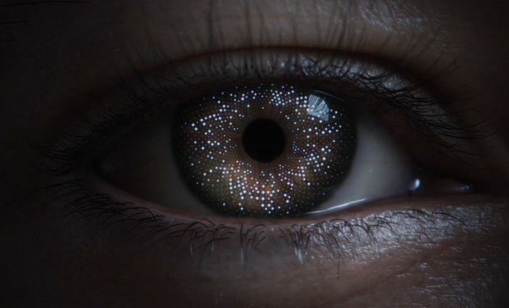

+++
title = '关于我'
date = '2025-07-04T20:13:21+08:00'
draft = false
+++

## 关于我

做过 PC web开发、mobile web开发、 web游戏开发，也尝试过 Apple Vision Pro 上的游戏开发，专注用户交互，梦想是做出**性能强劲**，用户**体验优异**，能产生业务价值的产品

### 常用工具箱

- 语言：TypeScript、C++
- 框架：React、NestJs
- 运行时：Node.js、Chrome/浏览器、visionOS
- 标准：webGPU、WebAssembly、

### 历史项目

- 淘宝商品创新表达（消费电子行业3D、快消行业序列帧、家装行业全景视频）
- 淘宝3D引擎对应的相关产品
  - 端渲染和云渲染协同切换（webRTC、追帧算法）
  - 引擎Binding技术方案落地（quickJS、wasm）
  - 引擎对应的3D编辑器（编辑器、节点编辑、AI Agent）

### 专利

- 一种基于端云协同的三维场景加载及渲染技术（2024-01-12）
- 全景视频投放素材生产与展示设计方案（中国 2024-06-11，中国香港2025-01-17）

## 联系方式

- 邮箱：<isgenluo@gmail.com>
- GitHub：[我的GitHub主页](https://github.com/genluo)
