+++
date = '2025-10-28T17:45:42+08:00'
draft = false
title = 'Agent'
description = 'Agent 相关技术调研，按照自己的层级思路，具体的介绍是AI生成的'
+++

## `Agent` 内容

整个 `Agent` 相关技术拆为两个大的部分进行介绍，一个是对应的工作流，一个是对应的 `Agent` 开发相关技术

### 工作流介绍

* 顺序执行型：ReAct、Plan & Execute、流水式、提示链
* 协作优化型：自协商、评估优化、多智能体协作、分层规划
* 动态编排型：动态编排、自演化、混合模式、路由、并行化、协调者-工作者

#### 顺序执行型

##### 1. ReAct

通过推理（Reasoning）和行动（Acting）交替循环的方式，让Agent在思考和执行工具之间迭代，直到完成任务。

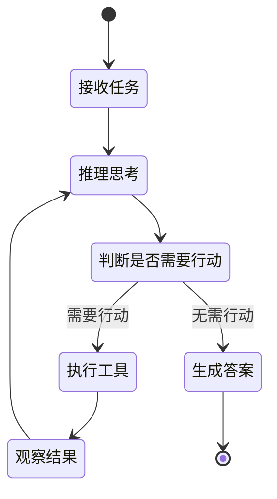

##### 2. Plan & Execute

先制定完整的执行计划，然后按照计划逐步执行各个步骤，适合复杂任务的分解与执行。

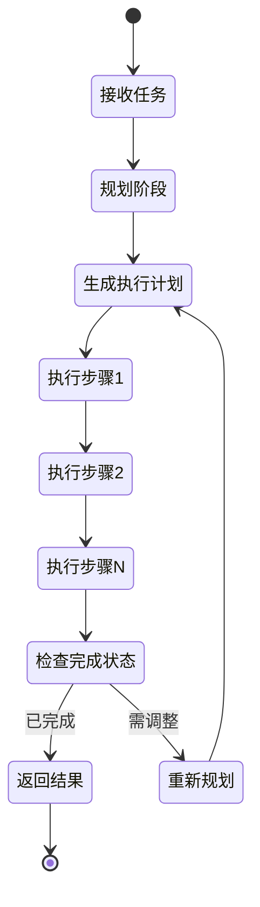

##### 3. 流水式

将任务按固定顺序分配到多个专门的Agent，每个Agent处理特定环节后传递给下一个，形成处理流水线。

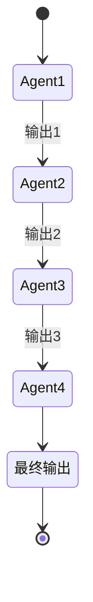

##### 4. 提示链

通过将复杂任务拆解为一系列简单的提示步骤，每步的输出作为下一步的输入，形成提示链式传递。

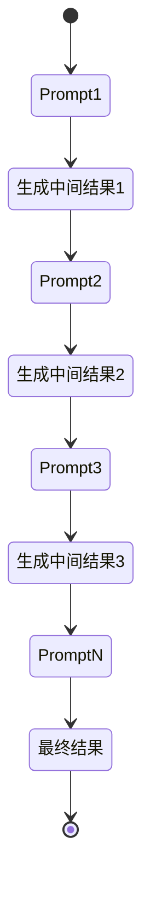

#### 协作优化型

##### 1. 自协商

Agent通过自我对话或多角色辩论的方式，从不同视角审视问题，通过协商达成更优的解决方案。

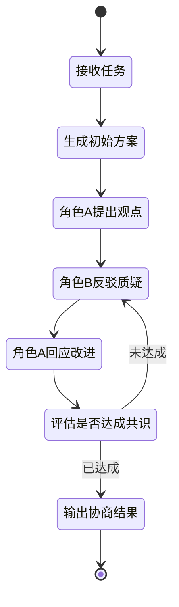

##### 2. 评估优化

通过独立的评估者Agent对执行结果进行评分和反馈，执行者根据反馈持续优化，直到达到质量标准。

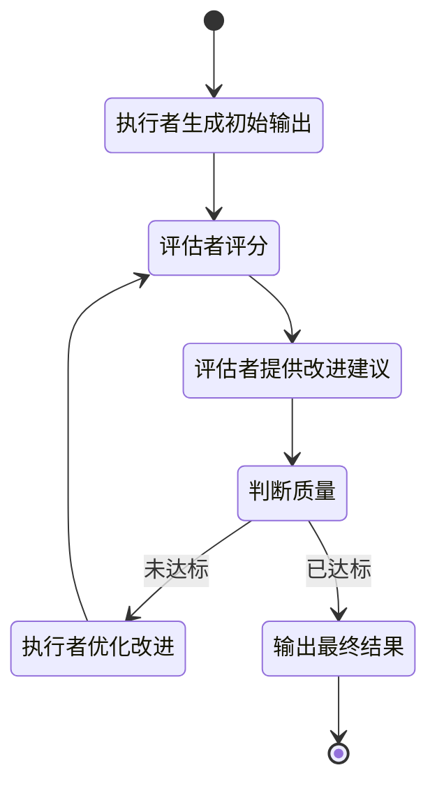

##### 3. 多智能体协作

多个具有不同专长的 `Agent` 协同工作，通过信息共享和任务分配，发挥各自优势完成复杂任务。

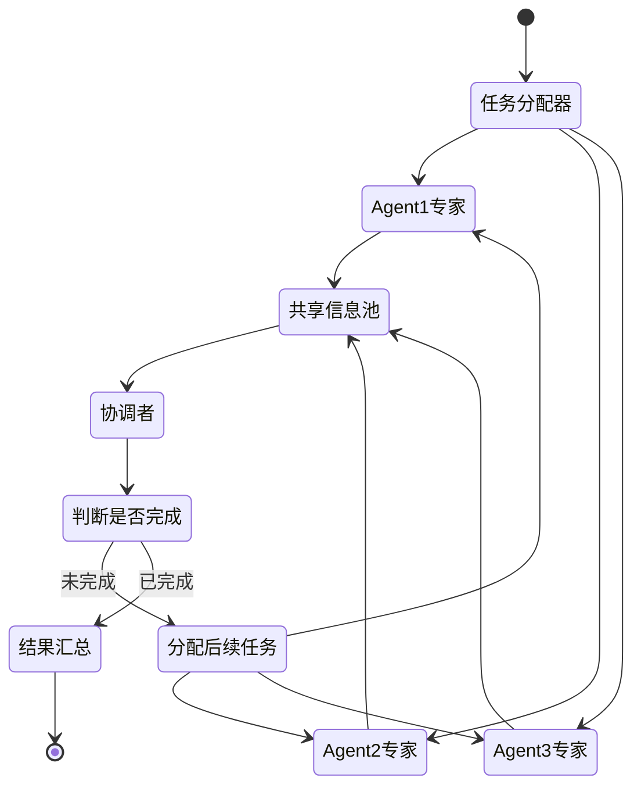

##### 4. 分层规划

采用层次化的规划策略，高层Agent负责宏观规划和目标分解，低层Agent负责具体执行，实现复杂任务的结构化管理。

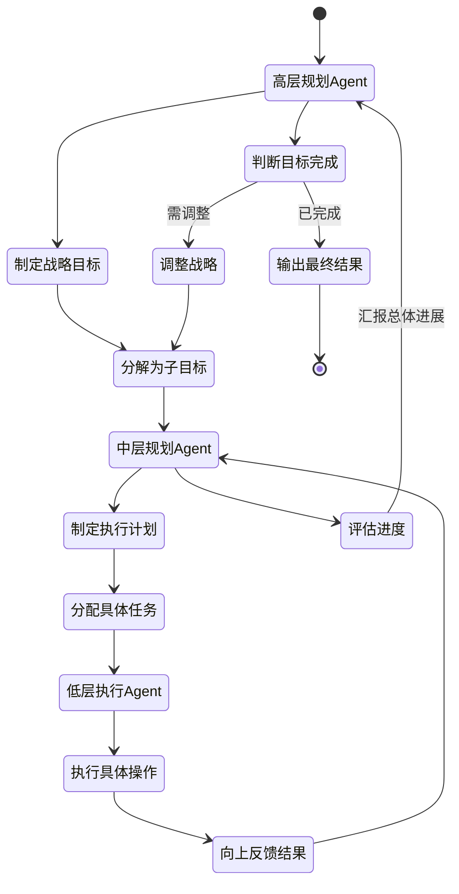

#### 动态编排型

##### 1. 动态编排

根据任务执行过程中的实时状态和反馈，动态调整工作流程和 `Agent` 组合，实现灵活的任务编排。

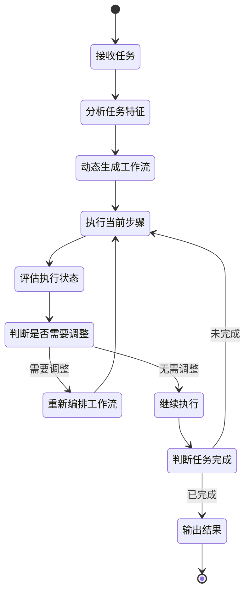

##### 2. 自演化

`Agent` 通过学习历史经验和反馈，不断优化自身的提示词、工具选择和决策策略，实现自我进化。

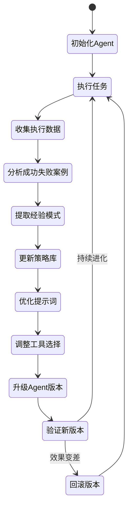

##### 3. 混合模式

结合多种工作流模式的优势，针对不同子任务采用最适合的执行模式，形成混合工作流架构。

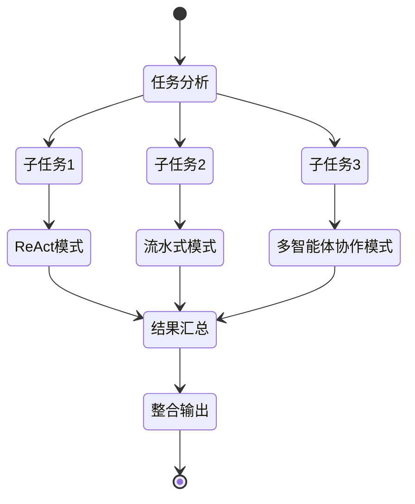

##### 4. 路由

根据任务类型、复杂度或领域特征，智能路由到最适合的 `Agent` 或处理流程，实现任务的精准分发。

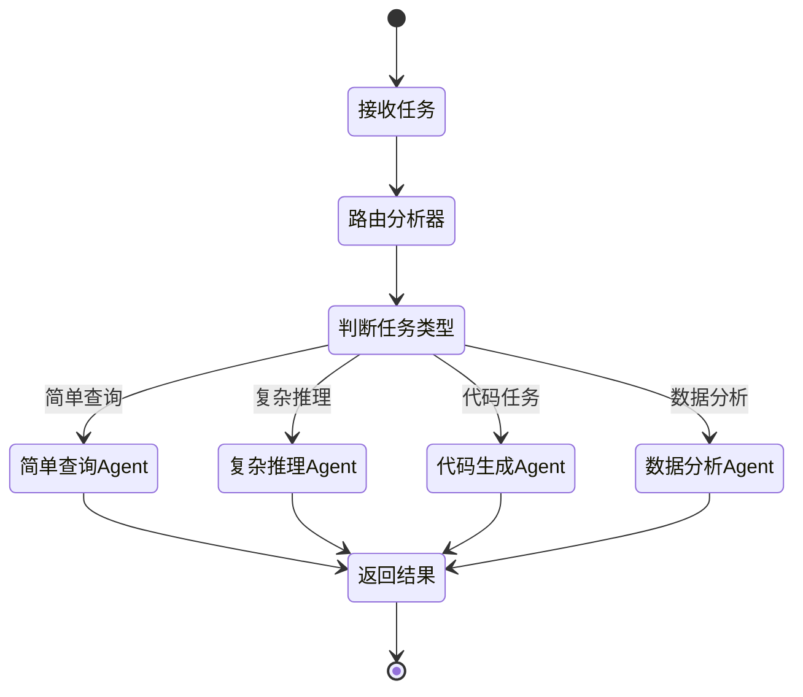

##### 5. 并行化

将独立的子任务或步骤并行分配给多个 `Agent` 同时执行，显著提升整体执行效率。

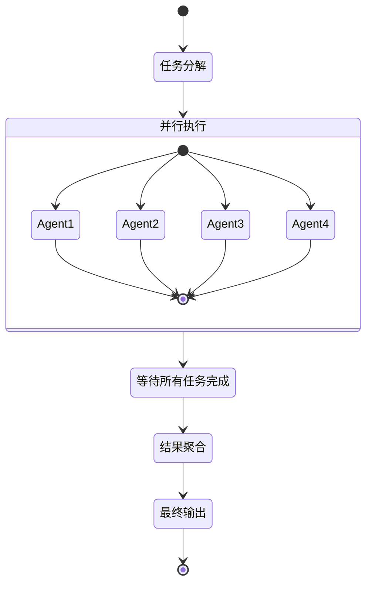

##### 6. 协调者-工作者

协调者 `Agent` 负责任务分配、进度监控和结果整合，工作者 `Agent` 专注于执行具体任务，实现职责分离。

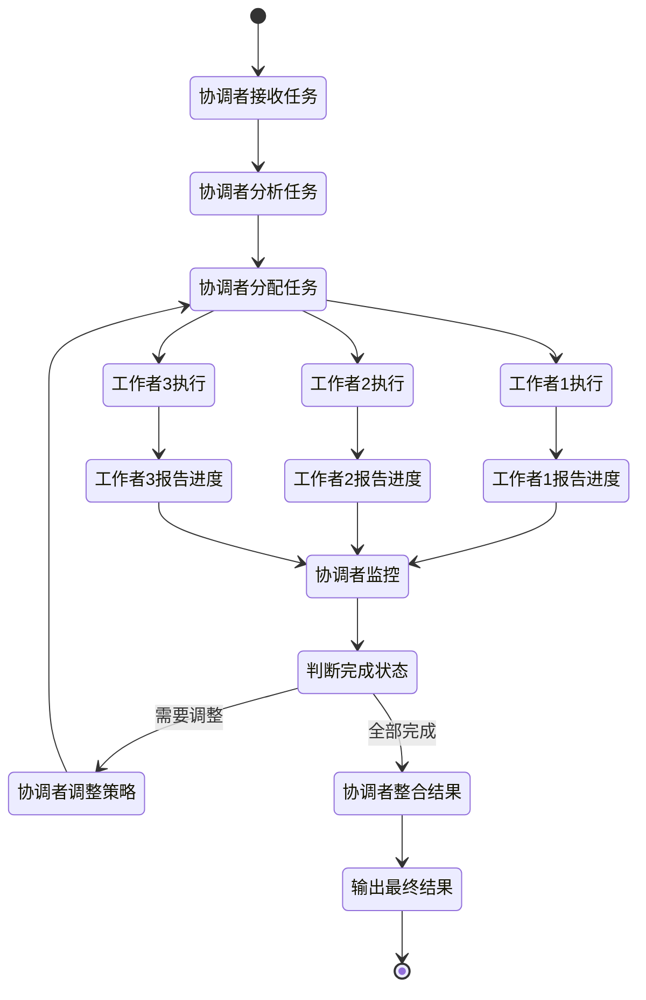

### `Agent` 相关技术

#### 上下文

##### 问题

###### 1. 上下文中毒

指错误信息、幻觉内容或过时数据被写入 `Agent` 的上下文后，被模型反复引用、强化，最终导致整个推理链条崩坏的现象。一旦错误信息进入上下文，模型会将其视为可信事实，在后续推理中不断基于这些错误前提进行演绎，形成错误累积和放大效应。

**解决思路**：建立信息源可信度评估机制，对外部输入进行验证；引入事实核查层，对关键信息进行交叉验证；使用时间戳标记上下文信息的时效性，定期更新过时数据；实施上下文质量监控，检测推理链中的逻辑矛盾；采用多路径验证策略，通过不同推理路径交叉印证结果的正确性。

###### 2. 上下文干扰

指上下文中存在过多无关或冗余信息，干扰模型对关键信息的识别和处理。在长对话或复杂任务中，早期的无关细节可能分散模型注意力，降低对当前任务重点的把握能力。

**解决思路**：采用上下文压缩技术提取关键信息摘要；实施滑动窗口机制只保留最近的相关对话；使用相关性评分算法筛选高价值信息；引入注意力引导提示词明确指向当前任务重点；定期进行上下文清理，移除过时或无关内容。

###### 3. 上下文混淆

指多个任务或对话线程的信息在上下文中交织，导致模型无法正确区分和关联相关信息。当处理多轮嵌套对话或并行任务时，模型可能混淆不同场景的参数、状态或目标。在 `MCP`（Model Context Protocol）场景中，当可用工具数量过多时，模型难以准确匹配工具功能与任务需求，容易选错工具或混淆相似工具的使用场景。

**解决思路**：为不同任务或对话线程分配独立的上下文空间；使用明确的标识符或分隔标记区分不同场景；采用命名空间机制隔离不同任务的状态和变量；建立上下文索引系统快速定位相关信息；在提示词中显式声明当前操作的任务范围；对于 `MCP` 工具管理，采用分层分类组织工具，根据任务类型动态加载相关工具子集，使用语义化的工具描述和示例增强工具识别度。

###### 4. 上下文飘移

指随着交互轮次增加，上下文逐渐偏离原始任务目标或主题的现象。模型可能在长对话中逐步丢失初始意图，转向相关但非核心的话题，导致最终输出与用户预期不符。

**解决思路**：在上下文中持久化保留原始任务目标作为锚点；定期回顾和重申初始意图；设置偏离度检测机制，当话题偏离超过阈值时触发提醒；使用目标导向的提示词模板引导对话回归主线；建立任务完成度评估体系，确保每个交互步骤与最终目标的关联性。

##### 技术

###### 1. 上下文压缩

上下文压缩是应对长文本处理和上下文窗口限制的关键技术，主要包括三种方式：

**过滤式压缩（删除）**：通过相关性评分、关键词匹配或语义相似度计算，筛选出与当前任务最相关的信息片段，过滤掉冗余或低价值内容，保留核心上下文，适用于需要快速降低上下文长度的场景，优势在于实现简单、效率高，但可能丢失潜在有用的边缘信息。

**提炼式压缩（浓缩）**：利用摘要模型或大语言模型对原始上下文进行语义提炼，将长文本浓缩为简洁的摘要或关键点列表，保留核心语义和逻辑关系，适用于需要保持信息完整性和连贯性的场景，能够在大幅压缩的同时保持语义质量，但依赖模型的理解和生成能力，可能引入摘要偏差。

**结构化压缩**：将非结构化的上下文信息转换为结构化表示，如知识图谱、表格、JSON对象或向量嵌入，通过结构化组织实现信息的高效存储和检索，适用于需要频繁查询和复用上下文的场景，优势在于支持精确检索和关系推理，但需要额外的结构化处理步骤，对信息的结构化质量要求较高。

###### 2. 上下文卸载

上下文卸载是将暂时不需要的上下文信息从活跃工作区转移到外部存储的技术，以释放有限的上下文窗口空间，主要包括以下几种方式：

**基于时间的卸载（LRU策略）**：采用最近最少使用（Least Recently Used）算法，根据上下文信息的访问时间戳，优先卸载最久未被访问的内容，这种方式假设最近使用的信息更可能在近期再次被需要，实现简单且适用于大多数场景，但可能误卸载重要但暂时未访问的关键信息，适合处理时序性强的对话和任务。

**基于优先级的卸载**：为上下文中的不同信息片段分配优先级权重，如任务目标、用户明确指令、关键决策节点等赋予高优先级，而中间推理过程、临时计算结果等赋予低优先级，当上下文空间不足时优先卸载低优先级内容，这种方式能够保护核心信息不被误删，但需要建立合理的优先级评估机制，适用于复杂任务和长期对话场景。

**基于语义相关性的卸载**：通过计算上下文片段与当前任务的语义相似度或相关性评分，卸载与当前任务关联度低的历史信息，利用向量嵌入和语义检索技术动态评估信息价值，这种方式能够智能识别真正无关的内容，但计算开销较大且依赖语义理解质量，适合需要精确保留相关上下文的知识密集型任务。

**分层卸载策略**：将上下文信息按照抽象层次分为不同级别，如原始对话记录、中间推理步骤、提炼后的结论和元信息等，优先卸载低层次的原始数据，保留高层次的精炼信息和摘要，这种方式在节省空间的同时保持信息的可追溯性，支持必要时从外部存储重新加载详细内容，适用于需要平衡详细度和效率的长期运行Agent。

**触发式卸载**：设置上下文使用率的阈值监控机制，当上下文占用率达到预设警戒线（如80%）时自动触发卸载流程，或在任务阶段切换、对话主题转移等关键节点主动进行上下文清理，这种方式结合了被动响应和主动管理，能够在保证性能的同时避免上下文溢出，适合动态变化的交互场景和多任务并行处理。

###### 3. 上下文存储

上下文存储是将卸载的上下文信息持久化保存并支持高效检索的技术，确保历史信息在需要时能够快速恢复到工作区，主要包括以下几种方式：

**向量数据库存储**：将上下文信息通过嵌入模型转换为高维向量表示，存储在专门的向量数据库（如Pinecone、Milvus、Weaviate）中，支持基于语义相似度的快速检索，这种方式能够实现"模糊匹配"式的上下文召回，根据当前任务需求检索语义相关的历史信息，适合需要智能联想和知识关联的场景，但向量化过程可能损失部分细节信息，且对嵌入模型质量依赖较高。

**关系数据库存储**：采用传统关系型数据库（如PostgreSQL、MySQL）存储结构化的上下文信息，通过表结构组织对话轮次、任务ID、时间戳、角色等元数据，支持精确的SQL查询和复杂的关联检索，这种方式适合需要严格事务保证和复杂查询逻辑的场景，能够高效处理结构化数据和关系推理，但对非结构化文本的语义检索能力有限，通常需要结合全文索引或向量检索增强。

**文档数据库存储**：使用文档型NoSQL数据库（如MongoDB、Elasticsearch）存储JSON格式的上下文文档，保留原始对话结构和嵌套关系，支持灵活的schema设计和全文检索，这种方式在保持数据完整性的同时提供较好的查询灵活性，适合半结构化数据和快速迭代的场景，Elasticsearch还提供强大的全文搜索和聚合分析能力，但在复杂关系查询上不如关系数据库。

**分层混合存储**：根据上下文信息的访问频率和重要性采用分层存储策略，热数据（近期高频访问）保存在内存缓存（如Redis）中实现毫秒级访问，温数据（中期偶尔访问）存储在高速SSD数据库中，冷数据（长期归档）转移到对象存储（如S3）或归档系统中，这种方式平衡了访问性能和存储成本，通过自动数据迁移机制实现生命周期管理，适合大规模长期运行的Agent系统。

**图数据库存储**：利用图数据库（如Neo4j、ArangoDB）将上下文信息建模为知识图谱，节点表示实体或概念，边表示关系或依赖，支持复杂的图遍历和关系推理查询，这种方式特别适合需要理解上下文间复杂关联关系的场景，如多轮对话中的指代消解、因果关系追踪、知识推理等，能够通过图算法发现隐含的信息关联，但图数据建模和维护成本较高。

**混合索引存储**：结合多种索引技术构建混合检索系统，如同时使用向量索引（语义检索）、倒排索引（关键词检索）、时间索引（时序查询）和元数据索引（属性过滤），根据查询需求动态选择最优检索路径或融合多路检索结果，这种方式能够应对多样化的上下文召回需求，提供更全面和精确的检索能力，适合复杂的企业级Agent应用，但系统复杂度和维护成本相对较高。

##### 管理

###### 1. 黑板模型

黑板模型（Blackboard Model）是一种经典的知识共享和协作架构，源于人工智能早期的专家系统研究，现在被广泛应用于多Agent系统的上下文管理中。其核心思想是模拟多个专家围绕一块"黑板"协作解决问题的场景：黑板作为共享的工作空间存储当前问题状态和中间结果，多个独立的知识源（Knowledge Sources）通过读取和更新黑板来协同工作，控制器负责协调各知识源的激活顺序。

**核心组件**：

1. **黑板（Blackboard）**：中央共享数据结构，存储问题求解过程中的所有信息，包括初始输入、中间推理结果、候选方案和最终解决方案。黑板通常采用分层结构组织信息，如原始数据层、特征提取层、假设层、决策层等，支持不同抽象级别的信息表示和访问。

2. **知识源（Knowledge Sources, KS）**：独立的专家模块，每个知识源负责特定领域或特定类型的推理任务，如数据解析、模式识别、约束检查、方案生成等。知识源之间相互独立，不直接通信，只通过读写黑板进行间接协作。每个知识源包含触发条件（Condition）和执行动作（Action），当黑板状态满足其触发条件时被激活执行。

3. **控制器（Controller）**：协调和调度机制，监控黑板状态变化，评估各知识源的触发条件，决定下一步激活哪个知识源，管理执行优先级和冲突解决。控制策略可以是规则驱动、优先级驱动、机会主义驱动或基于元知识的智能调度。

**工作流程**：

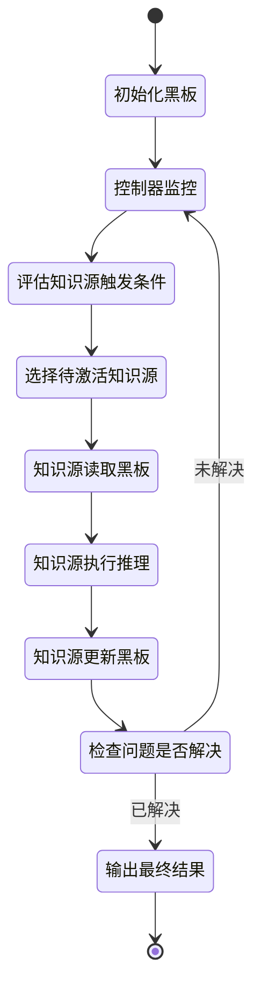

**在Agent上下文管理中的应用**：

1. **多Agent协作的信息共享**：黑板作为多个Agent之间的共享工作空间，每个Agent可以将自己的推理结果、发现的信息、生成的假设写入黑板，同时读取其他Agent贡献的内容，实现去中心化的信息交换，避免点对点通信的复杂性。

2. **异构知识的整合**：不同Agent可能使用不同的推理方式（符号推理、神经网络、规则引擎等）和知识表示（文本、结构化数据、向量等），黑板提供统一的接口和数据格式，使异构Agent能够无缝协作。

3. **增量式问题求解**：复杂任务的解决过程是渐进式的，黑板记录每一步的进展和中间状态，支持Agent从部分解逐步构建完整解，允许回溯和修正，适应动态变化的问题环境。

4. **机会主义推理**：不需要预定义严格的执行顺序，控制器根据当前黑板状态和各Agent的能力动态决定下一步行动，哪个Agent有能力推进当前状态就激活哪个，实现灵活的任务编排。

5. **上下文分层管理**：黑板的分层结构天然支持上下文的抽象层次管理，底层存储原始数据和详细信息，高层存储提炼后的知识和决策，Agent可以根据需要访问不同层次的上下文，实现精细化的上下文控制。

**优势**：

* **松耦合**：知识源之间独立，易于添加、删除或替换Agent，系统扩展性强
* **透明性**：所有信息集中在黑板上，便于监控、调试和解释推理过程
* **灵活性**：支持动态调度和机会主义推理，适应复杂多变的任务
* **容错性**：单个知识源失败不影响整体系统，其他知识源可以继续工作

**挑战**：

* **并发控制**：多个Agent同时读写黑板需要同步机制，避免竞态条件和数据不一致
* **调度复杂性**：设计高效的控制策略需要平衡全局最优和计算开销
* **黑板膨胀**：随着推理深入黑板信息量快速增长，需要结合上下文压缩和卸载技术
* **死锁风险**：不当的触发条件设计可能导致没有知识源被激活或循环等待

**现代实现方式**：

在现代Agent系统中，黑板模型常与向量数据库、消息队列、分布式缓存等技术结合实现：

* 使用Redis或共享内存作为高性能黑板存储
* 采用发布-订阅模式实现黑板更新的事件通知
* 结合向量检索实现基于语义的黑板信息查询
* 使用版本控制和事务机制保证并发安全
* 引入优先级队列和智能调度算法优化控制策略

###### 2. 类脑记忆

类脑记忆（Brain-inspired Memory）是借鉴人类大脑记忆机制设计的上下文管理方案，通过模拟人脑的多层次记忆系统、遗忘曲线、记忆巩固等认知过程，实现更加智能和高效的上下文管理。与传统的线性存储或简单缓存不同，类脑记忆强调记忆的动态性、层次性和自适应性，使Agent能够像人类一样选择性地记忆重要信息、遗忘无关细节、在需要时快速回忆相关经验。

**核心机制**：

1. **多层次记忆结构**：模拟人脑的感觉记忆、工作记忆（短期记忆）和长期记忆三级体系

   * **感觉记忆（Sensory Memory）**：极短暂的原始输入缓存，保留最近几轮的完整对话或感知数据，容量小但保真度高，类似人脑对刚刚发生事件的即时印象，通常保持数秒到数分钟，用于快速响应和上下文连贯性

   * **工作记忆（Working Memory）**：当前任务的活跃上下文，容量有限但访问速度快，存储正在处理的信息、中间推理步骤、临时变量和即时目标，对应Agent的"注意力焦点"，类似人脑在解决问题时能同时把握的信息量（约7±2个信息块）

   * **长期记忆（Long-term Memory）**：持久化的知识和经验库，容量几乎无限但需要检索激活，分为显性记忆（事实、事件）和隐性记忆（技能、模式），通过编码和巩固过程从工作记忆转入，支持基于相关性和重要性的选择性提取

2. **记忆编码与巩固**：模拟人脑将短期记忆转化为长期记忆的过程

   * **重要性评估**：根据信息的任务相关性、情感强度（用户明确强调）、重复频率、新颖性等维度计算重要性分数，决定是否值得长期保存

   * **语义编码**：将原始信息转换为语义表示（向量嵌入、知识图谱节点），提取关键概念和关系，去除冗余细节，便于后续的语义检索和关联

   * **巩固机制**：通过定期回顾、关联强化、摘要提炼等方式巩固重要记忆，类似人脑在睡眠中的记忆整合过程，可以在Agent空闲时或任务间隙进行后台巩固

3. **自适应遗忘机制**：模拟人脑的遗忘曲线（Ebbinghaus Forgetting Curve）

   * **时间衰减**：记忆强度随时间指数衰减，越久未访问的记忆越容易被遗忘，但重要记忆衰减速度较慢

   * **主动遗忘**：当存储空间不足时，优先遗忘低重要性、低访问频率、与当前任务无关的记忆，避免上下文膨胀

   * **遗忘保护**：对于核心知识、用户明确要求记住的信息、高频访问的记忆设置保护机制，防止误删

   * **可恢复性**：被遗忘的信息不是立即删除，而是降级到冷存储，必要时仍可恢复，类似人脑的"提取失败"而非"完全丢失"

4. **联想检索与激活扩散**：模拟人脑通过联想回忆相关记忆的过程

   * **语义联想**：基于向量相似度或知识图谱关系，从当前上下文触发相关记忆的检索，一个概念可以激活语义相近或有关联的其他记忆

   * **情景回忆**：根据相似的任务场景、问题模式或上下文特征，检索历史中的类似经验，支持案例推理和经验迁移

   * **激活扩散**：被激活的记忆节点会扩散激活相邻节点，形成记忆网络的局部激活区域，类似人脑的"一个想法引发另一个想法"

5. **记忆重构与更新**：模拟人脑记忆的可塑性和重构特性

   * **动态更新**：当新信息与已有记忆冲突时，更新或修正旧记忆，而非简单覆盖，保留版本历史以支持回溯

   * **记忆融合**：将多次相似经验融合为更抽象的模式或规则，提取共性知识，类似人脑的概念形成过程

   * **重构偏差意识**：记录记忆的来源、可信度和修改历史，避免因重构导致的记忆失真被当作原始事实

**工作流程**：

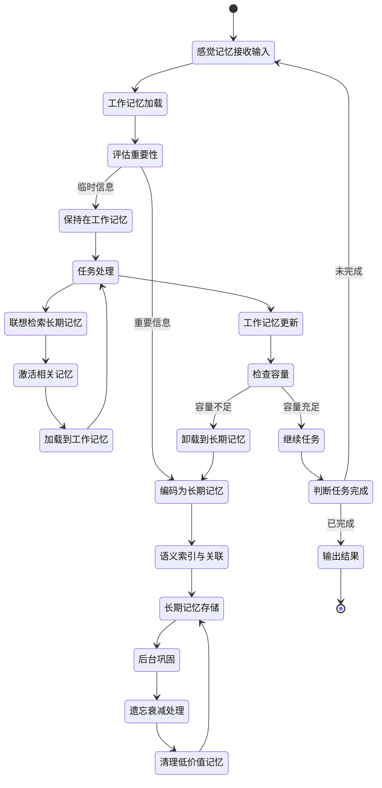

**在Agent上下文管理中的应用**：

1. **智能容量管理**：通过多层次结构和自适应遗忘，自动平衡上下文窗口的有限容量与信息完整性需求，无需人工设置复杂的卸载规则

2. **经验积累与迁移**：长期记忆中积累的历史经验可以在新任务中被联想检索，实现跨任务的知识迁移和快速适应

3. **上下文连贯性**：工作记忆保持当前任务的活跃状态，感觉记忆提供即时历史，确保对话和推理的流畅性

4. **个性化记忆**：针对不同用户或任务领域，形成差异化的长期记忆库，实现个性化的上下文管理

5. **抗干扰能力**：通过重要性评估和选择性编码，过滤噪音信息，避免上下文中毒和干扰

**优势**：

* **自然性**：符合人类认知习惯，易于理解和调试
* **自适应**：根据任务特点和信息重要性动态调整记忆策略
* **高效性**：多层次结构优化了访问速度和存储成本的平衡
* **鲁棒性**：遗忘机制防止上下文膨胀，联想检索增强信息利用率

**挑战**：

* **复杂性**：实现完整的类脑记忆系统需要多个子模块协同工作
* **参数调优**：遗忘曲线、重要性权重、巩固策略等参数需要针对具体应用场景调优
* **计算开销**：后台巩固、联想检索、激活扩散等过程增加计算负担
* **评估困难**：记忆质量和遗忘合理性难以量化评估

**实现技术**：

* **向量数据库**：存储长期记忆的语义表示，支持高效的联想检索（如Pinecone、Milvus）
* **图数据库**：建模记忆间的关联关系，支持激活扩散和关系推理（如Neo4j）
* **优先级队列**：管理工作记忆的容量和信息优先级
* **时间序列数据库**：记录记忆的访问历史和衰减曲线（如InfluxDB）
* **强化学习**：优化重要性评估和遗忘策略的参数
* **注意力机制**：在工作记忆中动态聚焦最相关的信息片段

###### 3. 解耦模块与动态扩展

解耦模块与动态扩展是 L2MAC（Large Language Model Agent with Multi-Agent Collaboration）等先进架构中突破上下文长度限制的核心方法，通过将复杂任务分解为多个独立的子任务模块，每个模块维护自己的局部上下文，避免单一 Agent 的上下文窗口被快速耗尽。这种方法的本质是"分而治之"——将原本需要在一个超长上下文中处理的信息，分散到多个专门化的模块中，通过模块间的协作和信息传递完成整体任务。

**核心思想**：

传统的单体 Agent 在处理复杂任务时，需要将所有相关信息（任务描述、历史对话、工具文档、中间结果等）都塞入一个上下文窗口，很快就会遇到长度限制。L2MAC 通过模块化解耦，将任务处理流程拆分为多个职责明确的模块，每个模块只需要关注自己负责的子任务和相关上下文，大大降低了单个上下文的负担。

**L2MAC 的模块化架构**：

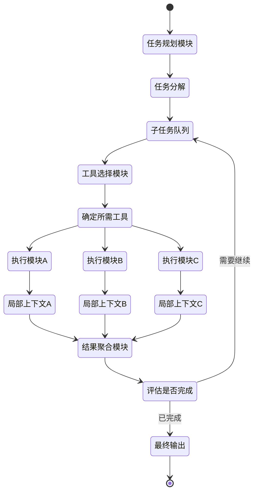

**关键技术机制**：

1. **任务分解与模块分配（Task Decomposition and Module Assignment）**：

   * **分层规划**：高层规划模块将复杂任务分解为多个相对独立的子任务，每个子任务分配给专门的执行模块，规划模块只需维护任务依赖关系和执行顺序，不需要保留所有细节

   * **职责隔离**：每个执行模块只负责特定类型的子任务（如数据检索、代码生成、结果验证等），只需加载与该子任务相关的上下文和工具，避免无关信息的干扰

   * **动态加载**：根据当前子任务的需求，动态加载相应的工具文档、示例和知识，用完即卸载，而不是一开始就将所有可能用到的信息塞入上下文

2. **局部上下文管理（Local Context Management）**：

   * **上下文隔离**：每个执行模块维护独立的局部上下文，只包含当前子任务的输入、相关知识和执行历史，与其他模块的上下文物理隔离，互不干扰

   * **按需传递**：模块间通过精简的消息传递接口交换信息，只传递必要的结果和状态，而不是完整的上下文历史，例如执行模块 A 完成后只向聚合模块传递结果摘要，而不是整个推理过程

   * **上下文重置**：每个子任务完成后，其执行模块的上下文可以被清空或归档，为下一个子任务释放空间，实现上下文的循环利用

3. **增量式信息聚合（Incremental Information Aggregation）**：

   * **流式聚合**：结果聚合模块不是等所有子任务完成后一次性处理，而是采用流式聚合，每当一个子任务完成就立即整合其结果，保持聚合模块的上下文精简

   * **摘要提炼**：对每个子任务的输出进行摘要提炼，提取关键信息后再加入全局上下文，过滤掉冗余细节，例如将一个 1000 token 的执行日志压缩为 50 token 的结果摘要

   * **分层存储**：将详细的执行过程存储在外部（如向量数据库），全局上下文只保留高层摘要，需要时通过检索召回细节

4. **工具与知识的按需加载（On-demand Tool and Knowledge Loading）**：

   * **工具分组**：将大量工具按功能域分组（如文件操作、网络请求、数据处理等），每个执行模块只加载其需要的工具组，避免工具列表过长导致的上下文膨胀和工具选择混淆

   * **延迟加载**：工具的详细文档和示例不在初始化时加载，而是在确定需要使用某个工具后才加载其详细说明，使用后立即卸载

   * **知识索引**：将领域知识构建为可检索的知识库，执行模块根据子任务需求动态检索相关知识片段，而不是预先加载所有知识

5. **模块间的轻量通信（Lightweight Inter-Module Communication）**：

   * **消息队列**：使用消息队列或事件总线实现模块间的异步通信，发送方只需投递消息，不需要维护接收方的状态，降低耦合度

   * **标准化接口**：定义统一的消息格式和接口协议，模块间交换的数据结构化且精简（如 JSON 格式的任务描述和结果），避免传递冗长的自然语言描述

   * **状态外部化**：共享状态存储在外部状态管理器（如 Redis、数据库）中，模块通过状态 ID 引用，而不是在上下文中复制完整状态

6. **并行执行与上下文复用（Parallel Execution and Context Reuse）**：

   * **并行模块**：对于相互独立的子任务，可以启动多个执行模块并行处理，每个模块使用独立的上下文窗口，突破单一上下文的串行处理限制

   * **模块池**：维护一个执行模块池，相同类型的子任务可以复用同一类模块实例，共享工具加载和初始化开销，但保持上下文隔离

   * **上下文模板**：为常见的子任务类型预定义上下文模板，快速初始化执行模块，减少重复的上下文构建成本

**实际应用示例**：

假设一个复杂任务："分析某公司最近三年的财报，生成投资建议报告"

**传统单体 Agent 的问题**：

* 需要在上下文中加载：任务描述、财报文档（可能很长）、分析工具文档、报告模板、历史对话等
* 上下文很快被耗尽，无法容纳完整的财报内容
* 工具选择时面对所有可用工具，容易混淆

**L2MAC 的解耦方案**：

1. **规划模块**：分解为子任务 → ①获取财报 ②提取关键指标 ③趋势分析 ④生成报告
2. **执行模块 1（财报获取）**：局部上下文只包含：公司名称、年份范围、文档检索工具 → 输出：财报文档路径
3. **执行模块 2（指标提取）**：局部上下文只包含：财报文档、数据提取工具 → 输出：结构化指标数据（精简）
4. **执行模块 3（趋势分析）**：局部上下文只包含：指标数据、分析算法工具 → 输出：分析结论摘要
5. **执行模块 4（报告生成）**：局部上下文只包含：分析结论、报告模板、生成工具 → 输出：最终报告
6. **聚合模块**：只需维护各阶段的摘要结果，而不是完整的中间过程

**优势**：

* **突破长度限制**：每个模块的上下文需求远小于整体任务，可以处理原本无法在单一上下文中完成的复杂任务
* **提高准确性**：模块专注于特定子任务，上下文更聚焦，减少无关信息的干扰，提高工具选择和推理的准确性
* **并行加速**：独立子任务可以并行执行，缩短总体执行时间
* **可扩展性**：新增功能只需添加新的执行模块，不影响现有模块
* **容错性**：单个模块失败不会污染其他模块的上下文，可以独立重试或替换

**挑战**：

* **任务分解质量**：分解不当可能导致子任务间依赖复杂，反而增加协调成本
* **信息损失**：模块间传递摘要可能丢失重要细节，需要平衡精简与完整性
* **协调开销**：模块间通信和状态管理引入额外的系统复杂度
* **调试困难**：问题可能出现在任何模块或模块间的交互，需要完善的监控和追踪机制

**实现技术**：

* **多 Agent 框架**：如 AutoGen、CrewAI、LangGraph 支持多 Agent 协作和模块化编排
* **消息队列**：如 Celery、RabbitMQ 实现模块间的异步任务分发
* **状态管理**：如 Redis、Memcached 存储共享状态和中间结果
* **工作流引擎**：如 Airflow、Prefect 管理复杂的模块依赖和执行流程
* **向量数据库**：如 Pinecone、Weaviate 存储和检索知识片段
* **分布式追踪**：如 OpenTelemetry、Jaeger 追踪跨模块的执行链路

###### 4. 领域定制化上下文优化

领域定制化上下文优化是针对特定应用领域（如医疗、法律、金融、代码生成等）的上下文管理策略，通过深度理解领域特性和任务模式，设计专门化的上下文组织、压缩和检索方案，相比通用方案能够显著提升上下文利用效率和任务完成质量。

**核心思想**：

不同领域的任务具有独特的信息结构、知识依赖和推理模式，通用的上下文管理方案往往无法充分利用这些领域特性。通过领域定制化，可以：

* 识别领域中的关键信息类型和优先级
* 设计符合领域逻辑的上下文结构
* 利用领域知识进行智能压缩和扩展
* 优化领域特定的信息检索和推理路径

**领域特性分析**：

1. **医疗领域**：
   * **信息特性**：患者病史、检查结果、诊断标准、药物信息等结构化程度高
   * **优先级**：最新的检查结果、过敏史、当前用药等关键信息必须保留
   * **推理模式**：基于症状→检查→诊断→治疗的流程化推理
   * **定制策略**：将患者信息结构化为医疗记录模板，关键字段（过敏、慢性病）设置高优先级永不卸载，历史就诊记录按时间和相关性分层存储

2. **法律领域**：
   * **信息特性**：法条、案例、证据材料、法律文书等，引用关系复杂
   * **优先级**：适用法条、关键证据、判例先例必须精确保留
   * **推理模式**：基于法条解释、案例类比、证据链推理
   * **定制策略**：构建法条知识图谱，通过引用关系检索相关法条，案例按相似度索引，证据材料按证明目标分类组织

3. **代码生成领域**：
   * **信息特性**：代码库结构、API 文档、依赖关系、代码规范等
   * **优先级**：当前编辑文件的上下文、直接依赖的接口定义、相关的代码示例
   * **推理模式**：基于代码结构理解、API 调用、设计模式应用
   * **定制策略**：通过 AST 分析提取代码结构，按调用关系和模块依赖动态加载相关代码，使用代码摘要（函数签名、类定义）代替完整实现

4. **金融领域**：
   * **信息特性**：市场数据、财务报表、交易规则、风险指标等，时效性强
   * **优先级**：最新市场数据、监管规则、风险阈值必须实时准确
   * **推理模式**：基于数据分析、趋势预测、风险评估
   * **定制策略**：时序数据按时间窗口聚合，历史数据存储统计特征而非原始值，规则和阈值参数化存储，通过参数引用而非重复描述

**定制化技术方法**：

1. **领域本体与知识图谱**：
   * 构建领域特定的本体模型，定义核心概念、关系和约束
   * 将领域知识组织为知识图谱，支持基于关系的上下文扩展和推理
   * 上下文中只保留概念节点 ID 和关系，详细信息通过图查询按需获取

2. **领域 DSL 与模板**：
   * 设计领域特定语言（DSL）简洁表达领域概念，减少自然语言的冗余
   * 预定义领域任务模板，标准化上下文结构，提高信息密度
   * 例如医疗领域用结构化的 SOAP 笔记（Subjective, Objective, Assessment, Plan）代替自由文本

3. **领域感知的压缩与摘要**：
   * 训练领域特定的摘要模型，理解领域术语和重要性
   * 基于领域知识的智能省略，例如法律文书中省略格式化条款，保留实质内容
   * 利用领域缩写和标准化表达，例如医疗领域的疾病编码（ICD-10）、药物通用名

4. **领域优化的检索策略**：
   * 设计领域特定的检索索引，例如代码领域按符号和调用关系索引，法律领域按法条编号和案由索引
   * 结合领域规则的混合检索，例如金融领域优先检索最新数据，医疗领域优先检索相关症状的诊断指南
   * 利用领域知识进行查询扩展，例如检索"高血压"时自动扩展到相关的"降压药"、"心血管疾病"

5. **领域特定的上下文分层**：
   * 根据领域任务流程设计上下文层次，例如代码生成分为"项目架构层"、"模块接口层"、"函数实现层"
   * 不同层次采用不同的保留策略和压缩比例
   * 支持按层次的上下文切换和聚焦

**优势**：

* **高效性**：充分利用领域特性，上下文密度和相关性更高
* **准确性**：符合领域逻辑的上下文组织提升推理质量
* **专业性**：使用领域术语和标准，输出更符合专业要求
* **可解释性**：基于领域知识的推理路径更易于专业人士理解和验证

**挑战**：

* **开发成本**：需要领域专家参与设计和验证
* **通用性损失**：过度定制可能降低跨领域的适应能力
* **维护成本**：领域知识和规则需要持续更新
* **冷启动问题**：新领域缺乏足够的领域知识积累

**实现技术**：

* **知识图谱**：Neo4j、ArangoDB 存储领域本体和知识关系
* **领域模型**：基于领域语料微调的 LLM 或专门的领域编码器
* **规则引擎**：Drools、Easy Rules 管理领域规则和约束
* **领域数据库**：针对特定领域优化的数据存储（如时序数据库 InfluxDB、医疗数据库 FHIR）
* **模板引擎**：Jinja2、Mustache 管理领域模板和 DSL

#### 多模型

##### 协同方式

多智能体系统中的协同方式决定了 `Agent` 之间如何分配任务、传递信息和协调行动，主要有三种协同方式：

###### 1. 自由转交（Free Handoff）

自由转交是一种去中心化的协同方式，`Agent` 之间可以自主决定何时、向谁转交任务，无需预定义的流程或中央协调者。每个 `Agent` 根据当前任务状态、自身能力边界和其他 `Agent` 的专长，动态选择最合适的协作对象进行任务转交。这种方式灵活性最高，适合探索性和复杂多变的任务，但可能面临协调复杂、效率不确定和难以追踪的挑战。

###### 2. 工作流编排（Workflow Orchestration）

工作流编排是一种预定义、结构化的协同方式，通过事先设计好的工作流程图或规则，明确规定任务的执行顺序、`Agent` 的职责分工和信息流转路径。通常由一个中央编排器（`Orchestrator`）负责协调和调度各个 `Agent` 的执行，确保任务按照既定流程有序推进。这种方式可预测性强、易于管理和监控，适合标准化、重复性的业务流程，但灵活性较差，难以应对动态变化的情况。

###### 3. Plan & Execute 协同（Plan & Execute Collaboration）

Plan & Execute 协同是一种结合了规划智能和执行灵活性的混合方式，先由规划 Agent 制定整体执行计划，然后由执行 Agent 按计划执行，执行过程中根据实际情况动态调整计划。规划 Agent 负责任务分解和宏观决策，执行 Agent 处理具体细节并反馈结果，形成计划-执行-反馈的闭环。这种方式在结构化和灵活性之间取得平衡，适合需要宏观规划和细节执行相结合的复杂多步骤任务，既有整体规划指导又能灵活应对变化。

##### 协同类型

多智能体系统中的协同类型反映了 `Agent` 之间的目标关系和互动模式，主要有三种协同类型：

###### 1. 合作（Cooperation）

合作是指多个 `Agent` 共享相同或一致的目标，通过明确的分工协作来共同完成任务。每个 `Agent` 发挥自己的专长负责特定子任务，彼此之间相互配合、信息共享，最终汇总各自的贡献形成完整解决方案。这种类型强调团队协作和优势互补，适合复杂任务的模块化分解，能够充分利用不同 `Agent` 的专业能力，但需要良好的协调机制来避免重复劳动和信息孤岛。

###### 2. 竞争（Competition）

竞争是指多个 `Agent` 针对同一问题独立提出不同的解决方案，通过辩论、评估或博弈的方式相互挑战和质疑，最终选出最优方案或综合各方观点。这种类型利用观点冲突和多样性来发现问题、纠正偏差、提升决策质量，类似于"红队-蓝队"对抗或多角度审视。竞争机制能够有效避免单一视角的盲点和群体思维陷阱，激发创新思维，但可能增加计算成本和决策时间，需要合理的评判标准来裁定优劣。

###### 3. 竞合（Coopetition）

竞合是合作与竞争的混合模式，`Agent` 之间在某些环节合作、在某些环节竞争，既有共同目标又存在局部利益冲突。例如多个 `Agent` 共同收集信息（合作），但各自独立提出解决方案并竞争最终采纳权（竞争），或者在迭代优化过程中交替进行协作改进和对抗验证。这种类型结合了合作的效率和竞争的质量保障，适合需要平衡多样性和一致性的复杂场景，能够在保持团队协同的同时激发个体创造力，但需要精心设计合作与竞争的边界和转换机制。

##### 通信结构

多智能体系统中的通信结构定义了 `Agent` 之间信息交换的拓扑关系和消息流转模式，主要有三种通信结构：

###### 1. 集中式（Centralized）

集中式通信结构采用中心节点（如协调者或编排器）作为信息枢纽，所有 `Agent` 之间的通信都通过中心节点中转和协调。中心节点负责接收各 `Agent` 的消息、进行任务分配、协调执行顺序、汇总结果，其他 `Agent` 不直接相互通信。这种结构管理简单、易于监控和全局优化，适合需要严格控制和集中决策的场景，但中心节点可能成为性能瓶颈和单点故障风险，且扩展性受限于中心节点的处理能力。

###### 2. 去中心化（Decentralized）

去中心化通信结构中没有固定的中心节点，`Agent` 之间采用点对点（P2P）的方式直接通信，每个 `Agent` 可以自主决定与谁交互、何时交互。`Agent` 之间地位平等，通过自组织和自协调完成任务，信息在网络中以分布式方式传播和处理。这种结构灵活性高、容错性强、无单点故障，适合动态变化和大规模分布式场景，但协调复杂度高，可能出现信息冗余或不一致，全局优化困难，需要设计良好的共识机制和冲突解决策略。

###### 3. 分层式（Hierarchical）

分层式通信结构将 `Agent` 组织为多层次的树状或金字塔结构，不同层级承担不同角色和职责。高层 `Agent` 负责宏观规划、战略决策和跨域协调，中层 `Agent` 负责任务分解和区域管理，底层 `Agent` 负责具体执行和数据采集。通信主要发生在相邻层级之间，上层向下层下达指令和目标，下层向上层反馈结果和状态。这种结构兼具集中式的可控性和去中心化的扩展性，适合大规模复杂系统和组织化任务，能够实现职责分离和抽象层次管理，但层级过多可能导致通信延迟和信息失真，需要平衡层次深度和通信效率。

##### 协同策略

多智能体系统中的协同策略决定了 `Agent` 如何进行决策和行动选择，主要有三种协同策略：

###### 1. 基于角色（Role-Based）

基于角色的协同策略为每个 `Agent` 分配明确的角色定位和职责范围，`Agent` 根据自己的角色来决定行为模式和交互方式。例如在软件开发团队中，可以设置产品经理、架构师、开发者、测试工程师等不同角色，每个角色有特定的专业知识、权限边界和工作流程。这种策略通过角色分工实现专业化和责任明确，便于管理和协调，适合职责清晰的结构化任务，但角色设计的合理性直接影响系统效能，且角色固化可能降低灵活性。

###### 2. 基于规则（Rule-Based）

基于规则的协同策略通过预定义的规则集来指导 `Agent` 的协同行为，规则明确规定在特定条件下应该采取什么行动、与谁协作、如何处理冲突。规则可以是简单的 if-then 条件语句，也可以是复杂的业务逻辑和约束条件。这种策略具有确定性和可解释性，行为可预测且易于审计，适合有明确规范和合规要求的领域（如金融、医疗），但规则的完备性和维护成本是挑战，难以应对规则未覆盖的新情况，且规则冲突时需要优先级机制。

###### 3. 基于模型（Model-Based）

基于模型的协同策略让 `Agent` 通过学习和推理来自主决定协同行为，而非依赖固定的角色或规则。`Agent` 可以使用机器学习模型（如强化学习）从历史经验中学习最优协作策略，或使用大语言模型进行情境理解和动态决策。这种策略具有高度的自适应性和智能性，能够处理复杂多变的场景，发现隐含的协作模式，适合开放性和不确定性高的任务，但模型的训练成本高、决策过程可解释性差，且需要大量数据和计算资源，模型质量直接决定协同效果。

##### 协同机制

多智能体系统中的协同机制决定了 `Agent` 协作关系的建立方式和时机，主要有两种协同机制：

###### 1. 静态协同（Static Collaboration）

静态协同机制在系统设计阶段就预定义好 `Agent` 之间的协作流程、交互关系和任务分配方案，运行时严格按照既定流程执行。协作图（包括 `Agent` 角色、连接关系、通信路径、执行顺序等）在启动前已经确定，不会因任务内容或执行状态而改变。这种机制具有高度的稳定性和可预测性，执行效率高且易于测试验证，适合流程固定、需求明确的标准化场景（如生产流水线、审批流程），但缺乏灵活性，难以应对任务变化和异常情况，扩展新功能需要重新设计整个协作流程。

###### 2. 动态协同（Dynamic Collaboration）

动态协同机制根据任务的具体需求和实时执行状态，在运行时动态创建和调整 `Agent` 之间的协作图。系统会分析任务特征、评估可用 `Agent` 的能力，实时决定需要哪些 `Agent` 参与、如何分工、以什么顺序执行，协作关系可以随着任务进展而演化。这种机制具有高度的灵活性和适应性，能够根据实际情况优化资源配置，适合复杂多变、需求不确定的场景（如应急响应、个性化服务），但动态决策增加了系统复杂度和计算开销，协作图的生成质量依赖于任务理解和 `Agent` 能力评估的准确性，且运行时的不确定性增加了调试和故障排查的难度。

#### 记忆系统

##### MEMGPT

<https://arxiv.org/abs/2310.08560>

MemGPT（Memory-enhanced GPT）是一个突破性的记忆系统，通过模拟操作系统的虚拟内存管理机制来突破大语言模型的上下文窗口限制。它将记忆分为主内存（main context）和外部存储（external context），通过智能的分页调度算法在有限的上下文窗口中动态加载最相关的记忆片段。MemGPT 引入了类似操作系统的内存管理指令集，Agent 可以显式地调用 `core_memory_append`、`core_memory_replace`、`archival_memory_insert`、`archival_memory_search` 等函数来管理自己的记忆，实现了对长期对话历史和大规模知识库的高效管理，使 Agent 能够在无限长的对话中保持连贯性和个性化。

##### A-MEM

<https://arxiv.org/abs/2502.12110>

A-MEM（Adaptive Memory）是一种自适应的多层次记忆系统，核心特点是根据信息的访问模式和重要性动态调整记忆的存储层级和保留策略。它采用分层存储架构（热-温-冷三层），结合访问频率、时间衰减和语义相关性等多维度指标，自动将记忆在不同存储层之间迁移。A-MEM 引入了记忆强化机制，被频繁访问或被 Agent 标记为重要的记忆会得到强化，衰减速度变慢并优先保留，而长期未使用的记忆则逐渐降级到冷存储甚至被遗忘。这种自适应机制使 Agent 能够像人类一样选择性地记住重要信息，自动平衡记忆容量和信息完整性。

##### Memory OS of AI Agent

<https://arxiv.org/abs/2506.06326>

Memory OS 是一个为 AI Agent 设计的完整记忆操作系统，提供了统一的记忆管理抽象层和丰富的记忆操作接口。它将记忆管理从 Agent 的核心逻辑中解耦出来，提供类似操作系统的系统调用接口，包括记忆的创建、读取、更新、删除、检索、索引、压缩、归档等全生命周期管理功能。Memory OS 支持多种记忆类型（情景记忆、语义记忆、程序记忆）和存储后端（向量数据库、图数据库、关系数据库），提供统一的查询语言和事务保证，使不同的 Agent 应用能够基于标准化的记忆接口进行开发，大幅降低记忆系统的实现复杂度和提高可移植性。

##### M3-Agent

<https://arxiv.org/pdf/2508.09736>

M3-Agent（Multi-Modal Multi-Memory Agent）是一个支持多模态和多记忆类型的综合记忆系统，特别强调跨模态信息的统一记忆和关联。它能够同时处理和记忆文本、图像、音频、视频等多种模态的信息，通过多模态编码器将不同模态统一映射到共享的语义空间，实现跨模态的记忆检索和推理。M3-Agent 区分了不同类型的记忆（如事实记忆、经验记忆、技能记忆、社交记忆），为每种记忆类型设计专门的存储结构和检索策略，并通过记忆融合机制将多源多模态的记忆片段整合为连贯的知识表示，使 Agent 能够在复杂的多模态交互场景中保持丰富的记忆能力。

##### Agent KB

<https://arxiv.org/pdf/2507.06229>

Agent KB（Agent Knowledge Base）是一个面向 Agent 的知识库系统，专注于结构化知识的组织和高效检索。与传统记忆系统侧重对话历史和经验不同，Agent KB 强调领域知识的系统化管理，采用知识图谱作为核心数据结构，将实体、概念、关系、规则等知识元素组织为可推理的图结构。它提供了知识的增量更新、版本管理、一致性校验、冲突解决等企业级功能，支持基于图遍历的复杂查询和多跳推理，并能够与外部知识源（如维基百科、企业数据库）进行知识同步和融合。Agent KB 使 Agent 能够基于结构化知识进行精确推理和可解释决策，特别适合知识密集型的专业领域应用。
