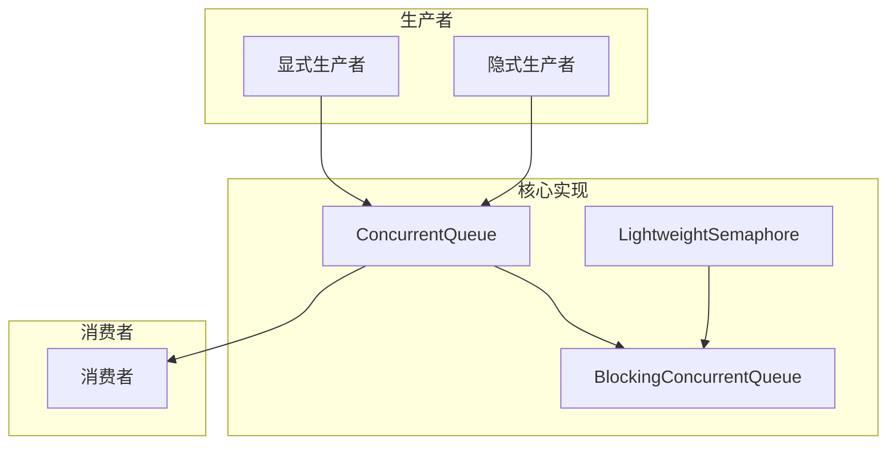

+++
date = '2025-08-25T10:28:00+08:00'
draft = true
title = 'Concurretqueue'
+++


## concurrentqueue 仓库介绍

这是一个名为 **moodycamel::ConcurrentQueue** 的高性能 C++ 无锁并发队列库，是工业级的线程安全队列实现。

### 🚀 核心特性

**性能优势：**

- **完全无锁设计**：所有核心操作（入队、出队）都不使用互斥锁，而是通过原子操作和内存序控制实现线程安全
- **极致性能**：在高并发场景下性能卓越，批量操作性能接近非并发队列
- **支持批量操作**：提供 enqueue_bulk 和 try_dequeue_bulk 等方法，一次性处理多个元素，显著提升吞吐量

**易用性：**

- **单头文件实现**：仅需包含 concurrentqueue.h 即可使用，易于集成
- **模板化设计**：无需处理指针，内存管理自动化
- **支持任意类型**：对元素类型无人为限制
- **C++11 标准**：充分利用移动语义，减少不必要的拷贝

**安全性：**

- **异常安全**：在抛出异常时保证资源不泄漏、状态一致
- **内存安全**：通过 Relacy 等工具验证，确保无内存泄漏、双重释放等问题

### 🏗️ 项目架构



### ✨ 独特设计

**多生产者架构：**

- 队列由多个子队列组成，每个生产者拥有独立的子队列
- 消费者轮询所有子队列进行消费
- 支持显式生产者（需要令牌管理）和隐式生产者（自动为线程创建）

**内存管理：**

- 使用连续内存块而非链表存储元素，提升缓存性能
- 支持预分配内存，避免运行时分配开销
- 通过内存池管理减少分配次数

### 🔧 使用场景

**适用场景：**

- 实时数据处理系统
- 游戏引擎中的任务队列
- 高频交易系统
- 多线程生产者-消费者模式
- 需要高吞吐量和低延迟的应用

**技术要求：**

- C++11 及以上标准
- 支持原子操作的编译器（VS2012+, g++ 4.8+）
- 跨平台兼容（无汇编代码，纯 C++11 实现）

### ⚡ 快速使用

```cpp
#include "concurrentqueue.h"

// 基本使用
moodycamel::ConcurrentQueue<int> q;
q.enqueue(42);

int item;
bool found = q.try_dequeue(item);

// 批量操作
std::vector<int> items = {1, 2, 3, 4, 5};
q.enqueue_bulk(items.begin(), items.size());

// 阻塞版本
#include "blockingconcurrentqueue.h"
moodycamel::BlockingConcurrentQueue<int> bq;
bq.wait_dequeue(item);  // 等待直到有元素可用
```

## 核心关注

### 1. 队列结构

### 2. 内存设计

### 3. 线程安全

## 问题记录

### 编译器扩展

- __builtin_expect() 是GCC编译器的一个内建函数，用于 分支预测优化。好处就是（带来5～15%的性能提升）：
  - 帮助CPU分支预测器做出更准确的预测
  - 优化代码布局，将热路径和冷路径分开
  - 提高缓存效率和整体性能
  - 特别适用于错误处理、边界检查等很少执行的代码路径
