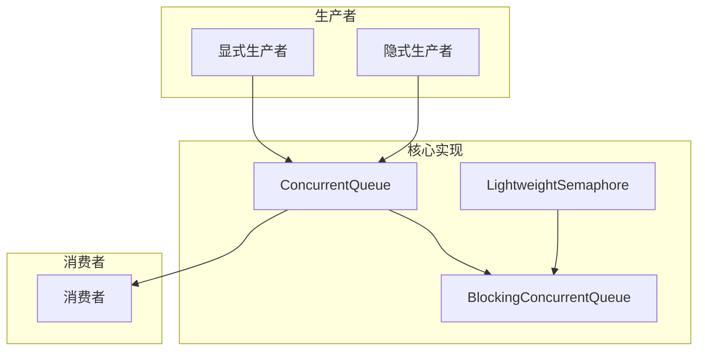

+++
date = '2025-08-25T10:28:00+08:00'
draft = true
title = 'Concurretqueue 源码阅读'
tags = ['源码', 'cpp']
description="本文主要记录阅读 Concurretqueue 源码过程中的一些相关想法和启发"
+++


## concurrentqueue 仓库介绍

这是一个名为 **moodycamel::ConcurrentQueue** 的高性能 C++ 无锁并发队列库，是工业级的线程安全队列实现。

### 🚀 核心特性

**性能优势：**

- **完全无锁设计**：所有核心操作（入队、出队）都不使用互斥锁，而是通过原子操作和内存序控制实现线程安全
- **极致性能**：在高并发场景下性能卓越，批量操作性能接近非并发队列
- **支持批量操作**：提供 enqueue_bulk 和 try_dequeue_bulk 等方法，一次性处理多个元素，显著提升吞吐量

**易用性：**

- **单头文件实现**：仅需包含 concurrentqueue.h 即可使用，易于集成
- **模板化设计**：无需处理指针，内存管理自动化
- **支持任意类型**：对元素类型无人为限制
- **C++11 标准**：充分利用移动语义，减少不必要的拷贝

**安全性：**

- **异常安全**：在抛出异常时保证资源不泄漏、状态一致
- **内存安全**：通过 Relacy 等工具验证，确保无内存泄漏、双重释放等问题

### 🏗️ 项目架构



### ✨ 独特设计

**多生产者架构：**

- 队列由多个子队列组成，每个生产者拥有独立的子队列
- 消费者轮询所有子队列进行消费
- 支持显式生产者（需要令牌管理）和隐式生产者（自动为线程创建）

**内存管理：**

- 使用连续内存块而非链表存储元素，提升缓存性能
- 支持预分配内存，避免运行时分配开销
- 通过内存池管理减少分配次数

### 🔧 使用场景

**适用场景：**

- 实时数据处理系统
- 游戏引擎中的任务队列
- 高频交易系统
- 多线程生产者-消费者模式
- 需要高吞吐量和低延迟的应用

**技术要求：**

- C++11 及以上标准
- 支持原子操作的编译器（VS2012+, g++ 4.8+）
- 跨平台兼容（无汇编代码，纯 C++11 实现）

### ⚡ 快速使用

```cpp
#include "concurrentqueue.h"

// 基本使用
moodycamel::ConcurrentQueue<int> q;
q.enqueue(42);

int item;
bool found = q.try_dequeue(item);

// 批量操作
std::vector<int> items = {1, 2, 3, 4, 5};
q.enqueue_bulk(items.begin(), items.size());

// 阻塞版本
#include "blockingconcurrentqueue.h"
moodycamel::BlockingConcurrentQueue<int> bq;
bq.wait_dequeue(item);  // 等待直到有元素可用
```

## 核心关注

### 1. 队列结构

**多生产者架构设计：**

ConcurrentQueue 采用了独特的多生产者单消费者（MPSC）架构，每个生产者线程都拥有自己的专用子队列。这种设计有效避免了生产者之间的竞争，提升了整体性能。

```cpp
// 伪代码展示内部结构
class ConcurrentQueue<T> {
    std::vector<SubQueue<T>*> producerQueues;  // 每个生产者的专用队列
    std::atomic<size_t> nextQueueIndex;        // 消费者轮询索引
};
```

**生产者类型：**

- **显式生产者（Explicit Producer）**：
  - 需要预先获取 ProducerToken
  - 性能更高，因为避免了线程本地存储查找
  - 适用于已知生产者数量的场景
  
- **隐式生产者（Implicit Producer）**：
  - 自动为新线程分配子队列
  - 使用线程本地存储管理令牌
  - 更灵活但性能略低

**队列扩展策略：**

- 初始容量较小，按需动态扩展
- 使用指数增长策略，避免频繁重分配
- 支持预分配，适用于已知容量需求的场景

### 2. 内存设计

**连续内存块优化：**

相比传统链表结构，ConcurrentQueue 使用连续内存块存储元素，带来显著的性能提升：

```cpp
// 传统链表 vs 连续内存块
// 链表：缓存不友好，每次访问可能导致缓存缺失
struct LinkedNode { T data; LinkedNode* next; };

// 连续块：缓存友好，预取效果好
struct Block { T elements[BLOCK_SIZE]; };
```

**内存池管理：**

- **块级分配**：减少系统调用次数，提升分配效率
- **延迟回收**：使用 epoch-based 回收机制，确保线程安全
- **内存对齐**：确保原子操作的正确性和性能

**NUMA 感知优化：**

- 尽量将生产者的内存分配在其运行的 CPU 节点上
- 减少跨节点内存访问的延迟
- 支持亲和性设置优化

**缓存行对齐：**

```cpp
// 避免伪共享，确保关键数据结构独占缓存行
struct alignas(CACHE_LINE_SIZE) ProducerData {
    std::atomic<size_t> tail;
    // padding 确保不会与其他数据共享缓存行
};
```

### 3. 线程安全

**无锁编程核心技术：**

ConcurrentQueue 完全基于原子操作实现线程安全，不使用任何互斥锁：

```cpp
// 核心原子操作
std::atomic<size_t> head;    // 消费者位置
std::atomic<size_t> tail;    // 生产者位置

// CAS 操作确保原子性
bool try_enqueue(T&& item) {
    size_t currentTail = tail.load(std::memory_order_acquire);
    // Compare-And-Swap 确保原子更新
    return tail.compare_exchange_weak(currentTail, currentTail + 1, 
                                     std::memory_order_acq_rel);
}
```

**内存序控制：**

- **acquire-release 语义**：确保操作的可见性顺序
- **relaxed ordering**：在性能关键路径使用，减少同步开销
- **seq_cst**：在需要全序的关键点使用

**ABA 问题解决：**

使用版本标记和指针压缩技术避免 ABA 问题：

```cpp
struct VersionedPointer {
    T* ptr;
    size_t version;  // 版本号防止 ABA 问题
};
```

**竞态条件避免：**

- **读-修改-写原子性**：使用 CAS 操作确保原子性
- **内存屏障**：确保操作的顺序性和可见性
- **延迟删除**：使用危险指针或 epoch-based 回收机制

**线程安全保证：**

- **生产者并发安全**：每个生产者独立操作自己的子队列
- **消费者安全**：单一消费者避免竞争，多消费者需要额外同步
- **异常安全**：确保在异常情况下不会破坏数据结构的一致性

## 问题记录

### 编译器扩展

- __builtin_expect() 是GCC编译器的一个内建函数，用于 分支预测优化。好处就是（带来5～15%的性能提升）：
  - 帮助CPU分支预测器做出更准确的预测
  - 优化代码布局，将热路径和冷路径分开
  - 提高缓存效率和整体性能
  - 特别适用于错误处理、边界检查等很少执行的代码路径
