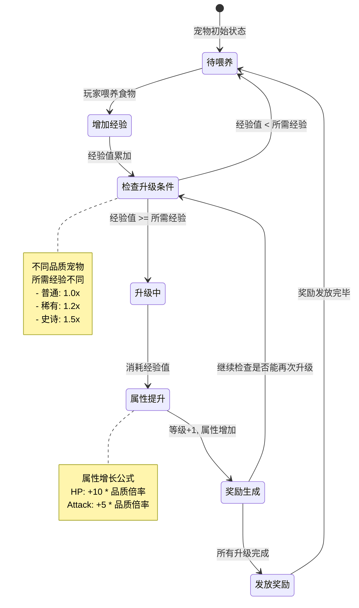
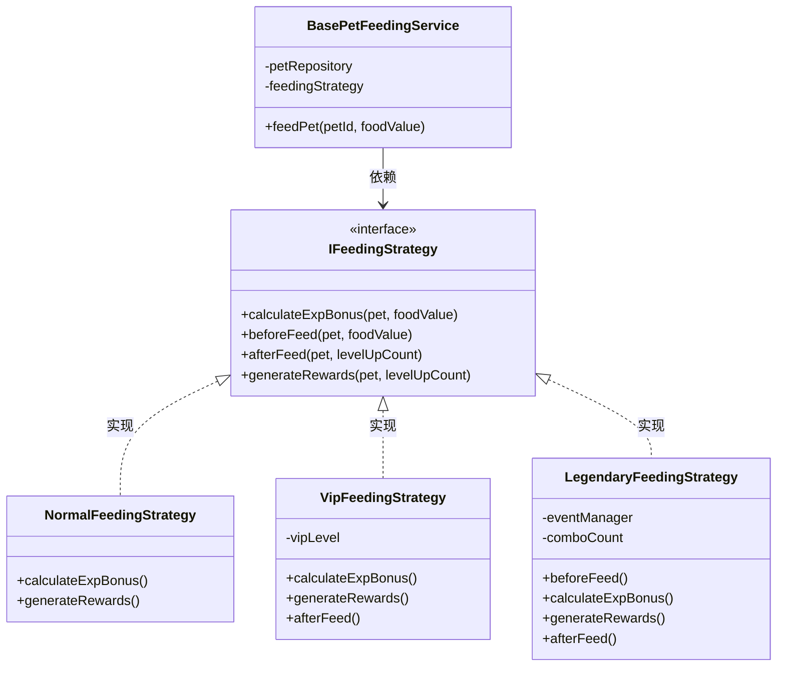
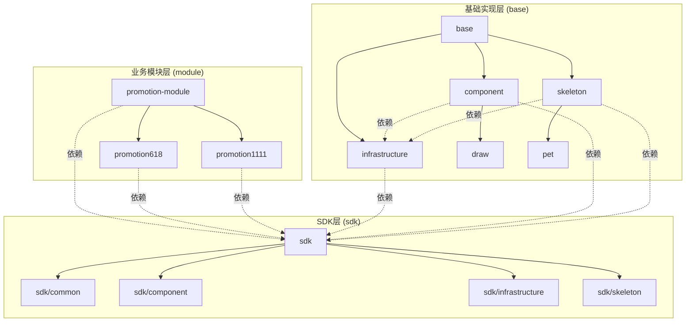

+++
date = '2025-09-01T10:16:15+08:00'
draft = false
title = '领域驱动设计'
description = '服务端中的领域驱动设计的应用及其解析'
tags = ['服务端']
+++

## 契机

最近因为一些契机看了下互动小游戏的服务端，深入了解了下现在互动游戏服务端的架构，同时也尝试在这个架构的基础上使用 AI 进行一些游戏业务功能开发，其中印象最深的服务端的一个称之为基座的架构设计，这个基座架构深度使用 `DDD` 领域设计思想进行抽象实现，在游戏业务非常灵活，复用性非常高，所以想看下在`NodeJS` 中针对 `DDD`领域驱动设计是否有一定的实践。下面主要分为两个部分，一个是为什么是`DDD`？另一个 `NodeJS`中一些实践

## `DDD`

### 什么是领域驱动设计（domain driving design）

领域驱动设计是一种软件设计方法，用于表示和组织特定领域中的知识和业务逻辑。它主要通过创建抽象的模型对象来模拟现实世界的实体及其关系，帮助开发人员理解和实现复杂系统的业务逻辑。在领域驱动设计中，通常会包含以下几个关键概念：

1. **实体（Entity）**：具有唯一标识的对象，通常表示业务中的一个独立的概念或对象。例如，在一个订单系统中，订单和客户可以被视为实体。

2. **值对象（Value Object）**：没有唯一标识的对象，通常用于描述某个实体的属性或细节。它们是不可变的，两个值对象如果具有相同的属性值，则认为是相等的。例如，一个地址可以作为一个值对象。

3. **聚合（Aggregate）**：一组相关的对象（实体和值对象）的集合，它们被视为一个单元进行数据修改。聚合有一个根实体（Aggregate Root），通过根实体来管理聚合的生命周期。

4. **领域服务（Domain Service）**：封装领域逻辑的操作，这些操作不属于任何一个实体或值对象。它们通常用于表示跨越多个实体或值对象的业务逻辑。

5. **仓储（Repository）**：提供访问持久化存储中对象的方法，通常用于获取和保存聚合根。

#### 什么是聚合根

指的是一个聚合中具有唯一标识的核心实体，该实体负责控制整个聚合的生命周期和一致性。

1. **控制访问**：聚合根是聚合内的唯一入口点，外部对象只能通过聚合根来访问或操作聚合中的其它对象。这有助于保持聚合内部的完整性和一致性。

2. **管理生命周期**：聚合根负责管理聚合内所有对象的生命周期，包括创建、更新和删除操作。通过聚合根，可以确保对聚合中数据的任何修改都是合法和一致的。

3. **一致性边界**：聚合定义了一个一致性边界，其中的所有对象在事务中应该保持一致。因此，聚合根通过确保在其范围内的操作都是一致的，来维持这种边界。

4. **唯一性**：每个聚合都有一个唯一的聚合根。通常，聚合根具有唯一标识符，用来标识和访问该聚合。

5. **持久化管理**：通过仓储（Repository）模式，聚合根通常是持久化操作（如保存和检索）的主要对象。这意味着仓储通常只直接处理聚合根，而不是聚合内的其它对象。

### 领域驱动设计优缺点

领域驱动设计（Domain-Driven Design, DDD）是一种软件设计方法，旨在通过紧密结合业务需求和技术实现来构建复杂软件系统。以下是领域驱动设计的一些优缺点：

#### 优点

1. **更好地理解业务**：
   - DDD强调与领域专家的密切合作，使开发团队对业务需求有更深入的理解。这有助于创建更符合业务需求的系统。

2. **清晰的模型**：
   - 通过使用统一语言和领域模型，所有团队成员（包括技术人员和非技术人员）都可以在同一语境下沟通，从而减少误解。

3. **灵活性和可维护性**：
   - DDD鼓励模块化设计，如界限上下文（Bounded Context）和聚合（Aggregate），这些设计有助于简化系统的维护和扩展。

4. **关注核心领域**：
   - 通过识别和聚焦于核心领域，DDD帮助团队将资源集中在对业务最重要的部分，从而提高竞争力。

5. **支持复杂系统开发**：
   - DDD为处理复杂领域逻辑提供了有力的方法和工具，可以有效地管理复杂性。

#### 缺点

1. **学习曲线陡峭**：
   - 对许多开发人员和组织来说，DDD的概念和技术术语可能较为陌生，初始学习和实施成本较高。

2. **时间和资源投入大**：
   - 由于需要深度的领域分析和持续的团队协作，DDD可能比传统方法花费更多时间和资源。

3. **不适合所有项目**：
   - 对于简单或小型项目，DDD可能过于复杂和冗余，投入的成本和收益不成比例。

4. **需求稳定性要求高**：
   - DDD更适合于需求相对稳定且对业务逻辑要求高的项目。对于需求频繁变化的项目，可能需要经常重构。

5. **对团队协作要求高**：
   - 成功实施DDD需要团队成员之间良好的沟通和协作，这对团队的组织文化和沟通能力提出了较高要求。

### 为什么需要领域模型

在传统的软件开发中,我们常常遇到以下问题：

#### 1. 贫血模型的困境

传统的开发方式往往采用"贫血模型"（Anemic Domain Model），即：

- **数据对象只包含字段和简单的 getter/setter**，没有任何业务逻辑
- **所有业务逻辑集中在 Service 层**，形成庞大的服务类
- **数据和行为分离**，导致代码难以理解和维护

#### 2. 业务逻辑散乱

- **缺乏统一的业务规则管理**：同样的业务逻辑可能在多个地方重复实现
- **难以保证一致性**：订单创建、修改、取消等操作中的业务规则可能不一致
- **维护成本高**：修改一个业务规则需要在多个地方查找和修改

#### 3. 技术与业务脱节

- **代码难以反映业务意图**：开发人员看到的是表、字段、SQL，而不是订单、支付、发货等业务概念
- **与领域专家沟通困难**：技术术语和业务术语无法对应，容易产生理解偏差
- **需求变更代价大**：业务调整时，需要从底层数据结构开始重新设计

#### 领域模型如何解决这些问题

领域模型通过以下方式解决上述问题：

##### 1. 封装业务逻辑

  ```javascript
  // 充血模型示例
  class Order {
    constructor(id, userId) {
      this.id = id;
      this.userId = userId;
      this.items = [];
      this.status = 'PENDING';
    }

    // 业务逻辑封装在实体内部
    addItem(product, quantity) {
      if (this.status !== 'PENDING') {
        throw new Error('只能向待处理订单添加商品');
      }
      if (quantity <= 0) {
        throw new Error('商品数量必须大于0');
      }
      this.items.push({ product, quantity });
    }

    submit() {
      if (this.items.length === 0) {
        throw new Error('订单不能为空');
      }
      this.status = 'SUBMITTED';
      // 触发领域事件
      this.addDomainEvent(new OrderSubmittedEvent(this));
    }

    calculateTotal() {
      return this.items.reduce((sum, item) =>
        sum + item.product.price * item.quantity, 0);
    }
  }
  ```

##### 2. 统一语言（Ubiquitous Language）

- 代码中的类名、方法名直接对应业务概念
- 开发人员和领域专家使用相同的术语
- 代码即文档，业务规则清晰可见

##### 3. 维护业务不变性（Invariants）

- 通过聚合根控制状态变更
- 确保对象始终处于有效状态
- 业务规则在一个地方定义和维护

##### 4. 降低认知负担

- 每个领域对象职责清晰
- 业务逻辑内聚，易于理解和测试
- 修改影响范围可控

#### 实践价值

引入领域模型后，带来的实际价值：

1. **代码可读性提升**：新人可以通过阅读领域模型快速理解业务
2. **维护成本降低**：业务规则集中管理，修改影响范围明确
3. **测试更容易**：领域对象可以独立测试，不依赖数据库和外部服务
4. **应对复杂度**：当业务逻辑变得复杂时，领域模型的优势更加明显
5. **长期价值**：随着项目演进，领域模型帮助保持代码质量和架构清晰度

> **总结**：领域模型不是银弹，但对于业务逻辑复杂的系统来说，它提供了一种更加贴近业务、易于维护的代码组织方式。通过将数据和行为结合，领域模型让代码真正成为业务知识的表达

### 举例

下面通过一个游戏中的"宠物喂养升级"模型来展示如何使用DDD进行设计

#### 业务场景

在一个宠物养成游戏中，玩家可以：

- 喂养宠物获得经验值
- 宠物经验值达到一定数量后进行升级
- 宠物升级后有对应的奖励物
- 最终根据宠物的奖励物发放对应的奖励

#### 业务流程图



**状态说明**：

1. **待喂养**：宠物的正常状态，等待玩家投喂食物
2. **增加经验**：喂养后经验值增加的瞬时状态
3. **检查升级条件**：判断当前经验是否足够升级（支持连续升级）
4. **升级中**：消耗经验值，进行等级提升
5. **属性提升**：根据品质倍率计算新的属性值
6. **奖励生成**：基于升级结果生成奖励物品
7. **发放奖励**：将奖励物品发放给玩家

#### 传统实现方式

```javascript
// 数据模型
class Pet {
  id;
  name;
  level;
  exp;
  quality; // 品质：普通、稀有、史诗
  hp;
  attack;
}

// Service层处理所有业务逻辑
class PetService {
  async feed(petId, foodValue) {
    // 1. 查询宠物
    const pet = await db.query('SELECT * FROM pets WHERE id = ?', [petId]);

    // 2. 计算经验值
    pet.exp += foodValue;

    // 3. 检查是否升级（逻辑分散）
    let levelUpCount = 0;
    while (pet.exp >= this.getRequiredExp(pet.level, pet.quality)) {
      pet.exp -= this.getRequiredExp(pet.level, pet.quality);
      pet.level += 1;
      levelUpCount++;
    }

    // 4. 升级后属性计算（逻辑复杂且容易出错）
    if (levelUpCount > 0) {
      pet.hp += levelUpCount * 10 * this.getQualityMultiplier(pet.quality);
      pet.attack += levelUpCount * 5 * this.getQualityMultiplier(pet.quality);

      // 5. 发送通知
      await this.sendLevelUpNotification(petId, pet.level);
    }

    // 6. 保存
    await db.query('UPDATE pets SET level=?, exp=?, hp=?, attack=? WHERE id=?',
      [pet.level, pet.exp, pet.hp, pet.attack, petId]);

    return pet;
  }

  getRequiredExp(level, quality) {
    // 升级所需经验计算逻辑
    const base = 100 * level;
    return quality === 'epic' ? base * 1.5 :
           quality === 'rare' ? base * 1.2 : base;
  }

  getQualityMultiplier(quality) {
    return quality === 'epic' ? 1.5 :
           quality === 'rare' ? 1.2 : 1.0;
  }
}
```

**问题**：

- 业务逻辑全在Service层，代码臃肿
- Pet只是数据容器，没有行为
- 升级规则、属性计算散落各处
- 难以保证宠物状态的一致性
- 测试困难，需要mock数据库

#### DDD实现方式

##### 1. 值对象（Value Object）- 经验值

```javascript
// 值对象：经验值
class Experience {
  constructor(current, level, quality) {
    if (current < 0) throw new Error('经验值不能为负');
    this.current = current;
    this.level = level;
    this.quality = quality;
  }

  // 获取升级所需经验
  getRequiredForNextLevel() {
    const baseExp = 100 * this.level;
    const multiplier = {
      'common': 1.0,
      'rare': 1.2,
      'epic': 1.5
    }[this.quality] || 1.0;

    return Math.floor(baseExp * multiplier);
  }

  // 添加经验，返回新的Experience对象（值对象不可变）
  add(value) {
    return new Experience(
      this.current + value,
      this.level,
      this.quality
    );
  }

  // 检查是否可以升级
  canLevelUp() {
    return this.current >= this.getRequiredForNextLevel();
  }

  // 消耗升级所需经验
  consumeForLevelUp() {
    const required = this.getRequiredForNextLevel();
    return new Experience(
      this.current - required,
      this.level + 1,
      this.quality
    );
  }
}
```

##### 2. 值对象 - 宠物属性

```javascript
// 值对象：属性
class PetStats {
  constructor(hp, attack, level, quality) {
    this.hp = hp;
    this.attack = attack;
    this.level = level;
    this.quality = quality;
  }

  // 升级后的属性
  levelUp() {
    const multiplier = {
      'common': 1.0,
      'rare': 1.2,
      'epic': 1.5
    }[this.quality] || 1.0;

    return new PetStats(
      this.hp + Math.floor(10 * multiplier),
      this.attack + Math.floor(5 * multiplier),
      this.level + 1,
      this.quality
    );
  }
}
```

##### 3. 领域事件

```javascript
// 领域事件：宠物升级事件
class PetLeveledUpEvent {
  constructor(petId, oldLevel, newLevel, stats) {
    this.petId = petId;
    this.oldLevel = oldLevel;
    this.newLevel = newLevel;
    this.stats = stats;
    this.occurredAt = new Date();
  }
}

// 领域事件：宠物喂养事件
class PetFedEvent {
  constructor(petId, foodValue, gainedExp) {
    this.petId = petId;
    this.foodValue = foodValue;
    this.gainedExp = gainedExp;
    this.occurredAt = new Date();
  }
}
```

##### 4. 实体/聚合根 - 宠物

```javascript
// 聚合根：宠物
class Pet {
  constructor(id, name, quality, experience, stats) {
    this.id = id;
    this.name = name;
    this.quality = quality; // 'common', 'rare', 'epic'
    this.experience = experience; // Experience值对象
    this.stats = stats; // PetStats值对象
    this.domainEvents = []; // 领域事件列表
  }

  // 喂养宠物
  feed(foodValue) {
    if (foodValue <= 0) {
      throw new Error('食物价值必须大于0');
    }

    // 添加经验
    const oldExp = this.experience;
    this.experience = this.experience.add(foodValue);

    // 记录喂养事件
    this.addDomainEvent(new PetFedEvent(
      this.id,
      foodValue,
      foodValue
    ));

    // 尝试升级
    this.tryLevelUp();
  }

  // 尝试升级（私有业务逻辑）
  tryLevelUp() {
    let levelUpCount = 0;

    // 循环升级（处理一次喂养多次升级的情况）
    while (this.experience.canLevelUp()) {
      const oldLevel = this.stats.level;

      // 消耗经验
      this.experience = this.experience.consumeForLevelUp();

      // 提升属性
      this.stats = this.stats.levelUp();

      levelUpCount++;

      // 触发升级事件
      this.addDomainEvent(new PetLeveledUpEvent(
        this.id,
        oldLevel,
        this.stats.level,
        {
          hp: this.stats.hp,
          attack: this.stats.attack
        }
      ));
    }

    return levelUpCount;
  }

  // 添加领域事件
  addDomainEvent(event) {
    this.domainEvents.push(event);
  }

  // 获取并清空领域事件
  pullDomainEvents() {
    const events = [...this.domainEvents];
    this.domainEvents = [];
    return events;
  }

  // 获取当前等级
  getLevel() {
    return this.stats.level;
  }

  // 获取当前经验进度（百分比）
  getExpProgress() {
    const required = this.experience.getRequiredForNextLevel();
    return (this.experience.current / required * 100).toFixed(2);
  }
}
```

##### 5. 仓储接口

```javascript
// 仓储接口
class IPetRepository {
  async findById(petId) {
    throw new Error('Not implemented');
  }

  async save(pet) {
    throw new Error('Not implemented');
  }
}

// 仓储实现
class PetRepository extends IPetRepository {
  constructor(db) {
    super();
    this.db = db;
  }

  async findById(petId) {
    const data = await this.db.query(
      'SELECT * FROM pets WHERE id = ?',
      [petId]
    );

    if (!data) return null;

    // 从数据重建领域对象
    return new Pet(
      data.id,
      data.name,
      data.quality,
      new Experience(data.exp, data.level, data.quality),
      new PetStats(data.hp, data.attack, data.level, data.quality)
    );
  }

  async save(pet) {
    // 保存聚合根
    await this.db.query(
      `UPDATE pets SET
        level = ?,
        exp = ?,
        hp = ?,
        attack = ?
      WHERE id = ?`,
      [
        pet.stats.level,
        pet.experience.current,
        pet.stats.hp,
        pet.stats.attack,
        pet.id
      ]
    );

    // 发布领域事件
    const events = pet.pullDomainEvents();
    for (const event of events) {
      await this.publishEvent(event);
    }
  }

  async publishEvent(event) {
    // 发布事件到事件总线
    // 例如：发送通知、更新排行榜等
    console.log('Domain Event:', event);
  }
}
```

##### 6. 应用服务（简洁的业务逻辑编排层）

```javascript
// 应用服务：只负责编排，不包含业务逻辑
class PetApplicationService {
  constructor(petRepository) {
    this.petRepository = petRepository;
  }

  async feedPet(petId, foodValue) {
    // 1. 加载聚合根
    const pet = await this.petRepository.findById(petId);

    if (!pet) {
      throw new Error('宠物不存在');
    }

    // 2. 执行业务逻辑（在领域模型中）
    pet.feed(foodValue);

    // 3. 持久化
    await this.petRepository.save(pet);

    // 4. 返回结果
    return {
      level: pet.getLevel(),
      exp: pet.experience.current,
      expProgress: pet.getExpProgress(),
      hp: pet.stats.hp,
      attack: pet.stats.attack
    };
  }
}
```

##### 7. 使用示例

```javascript
// 使用
const petService = new PetApplicationService(petRepository);

// 喂养宠物
const result = await petService.feedPet('pet-123', 250);
console.log(`宠物升级到${result.level}级，经验进度${result.expProgress}%`);

// 业务逻辑都在领域模型中，应用服务非常简洁
```

#### 更进一步

在实际业务中,我们常常需要在保持核心流程不变的情况下,允许不同的业务场景有定制化的逻辑。这时可以进一步通过**扩展点模式**来实现。

##### 业务场景扩展

假设我们的宠物系统需要支持不同类型的喂养策略：

- **普通宠物**：直接获得经验
- **VIP宠物**：获得经验加成,并有额外的属性提升
- **传说宠物**：喂养时触发特殊效果,可能获得额外奖励

##### 完整类型定义

首先,定义完整的类型系统：

```typescript
// ============= 基础类型定义 =============

// 奖励类型
type RewardType = 'gold' | 'diamond' | 'special_item' | 'rare_event';

// 奖励接口
interface Reward {
  type: RewardType;
  amount?: number;
  itemId?: string;
  eventId?: string;
  reason: string;
}

// 连击状态
type ComboStatus = 'GOOD' | 'GREAT!' | 'AMAZING!';

// 宠物等级评级
type PetRank = 'C级普通' | 'B级稀有' | 'A级史诗' | 'S级传说';

// VIP等级
type VipLevel = 1 | 2 | 3;

// ============= 扩展字段类型定义 =============

// VIP特权信息
interface VipPrivilege {
  savedFeeds: number;
  message: string;
}

// 连击信息
interface ComboInfo {
  comboCount: number;
  comboBonus: number;
  nextComboAt: number;
  comboStatus: ComboStatus;
}

// 每日限制信息
interface DailyLimit {
  remaining: number;
  total: number;
  resetAt: number;
}

// 特殊事件信息
interface SpecialEvents {
  triggered: boolean;
  events: Reward[];
  message: string;
}

// 传说统计信息
interface LegendaryStats {
  totalBonus: number;
  legendaryBonus: number;
  efficiency: string;
  rank: PetRank;
}

// ============= 返回结果类型定义 =============

// 基础返回结果接口
interface BaseFeedingResponse {
  level: number;
  exp: number;
  expProgress: string;
  hp: number;
  attack: number;
  levelUpCount: number;
  rewards: Reward[];
}

// 普通策略扩展字段
interface NormalFeedingExtensions {
  feedCount: number;
  totalExpGained: number;
}

// VIP策略扩展字段
interface VipFeedingExtensions {
  vipLevel: VipLevel;
  expBonus: number;
  bonusRate: string;
  vipPrivilege: VipPrivilege;
}

// 传说策略扩展字段
interface LegendaryFeedingExtensions {
  comboInfo: ComboInfo;
  dailyLimit: DailyLimit;
  specialEvents?: SpecialEvents;
  legendaryStats: LegendaryStats;
}

// 组合返回类型
type NormalFeedingResponse = BaseFeedingResponse & NormalFeedingExtensions;
type VipFeedingResponse = BaseFeedingResponse & VipFeedingExtensions;
type LegendaryFeedingResponse = BaseFeedingResponse & LegendaryFeedingExtensions;

// ============= 上下文类型定义 =============

interface FeedingContext {
  foodValue: number;
  expBonus: number;
  actualFoodValue: number;
}

// ============= 事件管理器接口 =============

interface EventManager {
  publish(event: any): Promise<void>;
}

// ============= Pet 相关接口（简化版） =============

interface Pet {
  id: string;
  name: string;
  quality: string;
  experience: any;
  stats: any;
  feed(foodValue: number): void;
  getLevel(): number;
  getExpProgress(): string;
}

interface IPetRepository {
  findById(petId: string): Promise<Pet | null>;
  save(pet: Pet): Promise<void>;
}
```

##### 返回结果封装类

```typescript
// 返回结果基类
class FeedingResult<T extends Record<string, any> = {}> {
  level: number;
  exp: number;
  expProgress: string;
  hp: number;
  attack: number;
  levelUpCount: number;
  rewards: Reward[];
  private extensions: T = {} as T;

  constructor(pet: Pet, levelUpCount: number, rewards: Reward[]) {
    this.level = pet.getLevel();
    this.exp = pet.experience.current;
    this.expProgress = pet.getExpProgress();
    this.hp = pet.stats.hp;
    this.attack = pet.stats.attack;
    this.levelUpCount = levelUpCount;
    this.rewards = rewards;
  }

  // 添加扩展数据（类型安全）
  addExtension<K extends keyof T>(key: K, value: T[K]): void {
    this.extensions[key] = value;
  }

  // 转换为响应对象
  toResponse(): BaseFeedingResponse & T {
    return {
      level: this.level,
      exp: this.exp,
      expProgress: this.expProgress,
      hp: this.hp,
      attack: this.attack,
      levelUpCount: this.levelUpCount,
      rewards: this.rewards,
      ...this.extensions
    } as BaseFeedingResponse & T;
  }
}
```

##### 策略接口定义

```typescript
// 喂养策略扩展点接口
interface IFeedingStrategy<TResponse extends BaseFeedingResponse = BaseFeedingResponse> {
  // 扩展点1：计算经验加成
  calculateExpBonus(pet: Pet, foodValue: number): number;

  // 扩展点2：喂养前的校验逻辑
  beforeFeed(pet: Pet, foodValue: number): Promise<boolean>;

  // 扩展点3：喂养后的额外处理
  afterFeed(pet: Pet, levelUpCount: number): Promise<void>;

  // 扩展点4：生成奖励
  generateRewards(pet: Pet, levelUpCount: number): Reward[];

  // 扩展点5：扩展返回结果
  extendResult(result: FeedingResult<any>, pet: Pet, context: FeedingContext): void;
}

// 抽象基础策略类（提供默认实现）
abstract class BaseFeedingStrategy<TResponse extends BaseFeedingResponse = BaseFeedingResponse>
  implements IFeedingStrategy<TResponse> {

  abstract calculateExpBonus(pet: Pet, foodValue: number): number;

  async beforeFeed(pet: Pet, foodValue: number): Promise<boolean> {
    // 默认实现：允许喂养
    return true;
  }

  async afterFeed(pet: Pet, levelUpCount: number): Promise<void> {
    // 默认实现：不做任何处理
  }

  abstract generateRewards(pet: Pet, levelUpCount: number): Reward[];

  extendResult(result: FeedingResult<any>, pet: Pet, context: FeedingContext): void {
    // 默认实现：不做任何扩展
  }
}
```

##### 应用服务（模板方法）

```typescript
// 基础喂养应用服务（模板方法）
class BasePetFeedingService<TResponse extends BaseFeedingResponse = BaseFeedingResponse> {
  constructor(
    private readonly petRepository: IPetRepository,
    private readonly feedingStrategy: IFeedingStrategy<TResponse>
  ) {}

  // 模板方法：定义喂养流程骨架
  async feedPet(petId: string, foodValue: number): Promise<TResponse> {
    // 1. 加载聚合根
    const pet = await this.petRepository.findById(petId);
    if (!pet) {
      throw new Error('宠物不存在');
    }

    // 2. 扩展点：喂养前校验
    const canFeed = await this.feedingStrategy.beforeFeed(pet, foodValue);
    if (!canFeed) {
      throw new Error('当前无法喂养宠物');
    }

    // 3. 扩展点：计算经验加成
    const expBonus = this.feedingStrategy.calculateExpBonus(pet, foodValue);
    const actualFoodValue = foodValue + expBonus;

    // 4. 执行核心业务逻辑
    const oldLevel = pet.getLevel();
    pet.feed(actualFoodValue);
    const newLevel = pet.getLevel();
    const levelUpCount = newLevel - oldLevel;

    // 5. 扩展点：生成奖励
    const rewards = this.feedingStrategy.generateRewards(pet, levelUpCount);

    // 6. 持久化
    await this.petRepository.save(pet);

    // 7. 扩展点：喂养后处理
    await this.feedingStrategy.afterFeed(pet, levelUpCount);

    // 8. 构建基础返回结果
    const result = new FeedingResult(pet, levelUpCount, rewards);

    // 9. 扩展点：扩展返回结果
    const context: FeedingContext = { foodValue, expBonus, actualFoodValue };
    this.feedingStrategy.extendResult(result, pet, context);

    // 10. 返回结果
    return result.toResponse() as TResponse;
  }
}
```

##### 业务实现扩展点

###### 1. 普通宠物喂养策略

```typescript
// 普通宠物喂养策略
class NormalFeedingStrategy extends BaseFeedingStrategy<NormalFeedingResponse> {
  calculateExpBonus(pet: Pet, foodValue: number): number {
    // 普通宠物没有加成
    return 0;
  }

  generateRewards(pet: Pet, levelUpCount: number): Reward[] {
    // 每升1级给100金币
    if (levelUpCount === 0) return [];

    return [{
      type: 'gold' as const,
      amount: 100 * levelUpCount,
      reason: '宠物升级奖励'
    }];
  }

  extendResult(
    result: FeedingResult<NormalFeedingExtensions>,
    pet: Pet,
    context: FeedingContext
  ): void {
    // 普通策略添加基础统计信息
    result.addExtension('feedCount', 1);
    result.addExtension('totalExpGained', context.actualFoodValue);
  }
}
```

###### 2. VIP宠物喂养策略

```typescript
// VIP宠物喂养策略
class VipFeedingStrategy extends BaseFeedingStrategy<VipFeedingResponse> {
  constructor(private readonly vipLevel: VipLevel) {
    super();
  }

  calculateExpBonus(pet: Pet, foodValue: number): number {
    // VIP玩家获得经验加成
    const bonusRates: Record<VipLevel, number> = {
      1: 0.1,  // VIP1: 10%加成
      2: 0.2,  // VIP2: 20%加成
      3: 0.3   // VIP3: 30%加成
    };

    return Math.floor(foodValue * bonusRates[this.vipLevel]);
  }

  generateRewards(pet: Pet, levelUpCount: number): Reward[] {
    if (levelUpCount === 0) return [];

    const rewards: Reward[] = [];

    // 基础金币奖励
    rewards.push({
      type: 'gold' as const,
      amount: 100 * levelUpCount,
      reason: '宠物升级奖励'
    });

    // VIP额外奖励
    rewards.push({
      type: 'diamond' as const,
      amount: 10 * levelUpCount * this.vipLevel,
      reason: 'VIP专属升级奖励'
    });

    return rewards;
  }

  async afterFeed(pet: Pet, levelUpCount: number): Promise<void> {
    if (levelUpCount > 0) {
      // VIP玩家升级后发送特殊通知
      console.log(`🎉 恭喜VIP${this.vipLevel}玩家，宠物${pet.name}升级到${pet.getLevel()}级！`);
    }
  }

  extendResult(
    result: FeedingResult<VipFeedingExtensions>,
    pet: Pet,
    context: FeedingContext
  ): void {
    // VIP策略添加VIP特权信息
    result.addExtension('vipLevel', this.vipLevel);
    result.addExtension('expBonus', context.expBonus);
    result.addExtension('bonusRate', `${(context.expBonus / context.foodValue * 100).toFixed(1)}%`);

    // 计算VIP特权节省的时间（假设）
    const savedFeeds = Math.floor(context.expBonus / context.foodValue);
    result.addExtension('vipPrivilege', {
      savedFeeds,
      message: `VIP${this.vipLevel}特权为您节省了${savedFeeds}次喂养`
    });
  }
}
```

###### 3. 传说宠物喂养策略

```typescript
// 传说宠物喂养策略
class LegendaryFeedingStrategy extends BaseFeedingStrategy<LegendaryFeedingResponse> {
  private comboCount: number = 0; // 连击次数
  private lastFeedTime: number | null = null;

  constructor(private readonly eventManager: EventManager) {
    super();
  }

  async beforeFeed(pet: Pet, foodValue: number): Promise<boolean> {
    // 传说宠物每天只能喂养3次
    const feedCountToday = await this.getFeedCountToday(pet.id);
    if (feedCountToday >= 3) {
      return false;
    }

    // 计算连击
    const now = Date.now();
    if (this.lastFeedTime && now - this.lastFeedTime < 5000) {
      this.comboCount++;
    } else {
      this.comboCount = 1;
    }
    this.lastFeedTime = now;

    return true;
  }

  calculateExpBonus(pet: Pet, foodValue: number): number {
    // 连击加成：每连击一次增加20%经验
    const comboBonus = Math.floor(foodValue * 0.2 * (this.comboCount - 1));

    // 传说宠物基础加成50%
    const legendaryBonus = Math.floor(foodValue * 0.5);

    return comboBonus + legendaryBonus;
  }

  generateRewards(pet: Pet, levelUpCount: number): Reward[] {
    if (levelUpCount === 0) return [];

    const rewards: Reward[] = [];

    // 基础奖励
    rewards.push({
      type: 'gold' as const,
      amount: 100 * levelUpCount,
      reason: '宠物升级奖励'
    });

    // 传说级大额钻石奖励
    rewards.push({
      type: 'diamond' as const,
      amount: 50 * levelUpCount,
      reason: '传说宠物升级奖励'
    });

    // 连击奖励
    if (this.comboCount >= 3) {
      rewards.push({
        type: 'special_item' as const,
        itemId: 'legendary_food',
        amount: 1,
        reason: `${this.comboCount}连击特殊奖励`
      });
    }

    // 触发稀有事件（概率）
    if (Math.random() < 0.1) {
      rewards.push({
        type: 'rare_event' as const,
        eventId: 'treasure_hunt',
        reason: '触发传说事件：寻宝之旅'
      });
    }

    return rewards;
  }

  async afterFeed(pet: Pet, levelUpCount: number): Promise<void> {
    // 发布传说宠物喂养事件（供其他系统监听）
    await this.eventManager.publish({
      type: 'LegendaryPetFed',
      petId: pet.id,
      level: pet.getLevel(),
      comboCount: this.comboCount,
      timestamp: Date.now()
    });

    if (levelUpCount > 0) {
      console.log(`⚡ 传说宠物${pet.name}升级！当前${this.comboCount}连击！`);
    }
  }

  private async getFeedCountToday(petId: string): Promise<number> {
    // 从缓存或数据库获取今日喂养次数
    // 这里简化处理
    return 0;
  }

  extendResult(
    result: FeedingResult<LegendaryFeedingExtensions>,
    pet: Pet,
    context: FeedingContext
  ): void {
    // 传说宠物添加丰富的扩展信息

    // 1. 连击系统信息
    const comboStatus: ComboStatus =
      this.comboCount >= 3 ? 'AMAZING!' :
      this.comboCount >= 2 ? 'GREAT!' : 'GOOD';

    result.addExtension('comboInfo', {
      comboCount: this.comboCount,
      comboBonus: Math.floor(context.foodValue * 0.2 * (this.comboCount - 1)),
      nextComboAt: this.lastFeedTime! + 5000,
      comboStatus
    });

    // 2. 今日剩余喂养次数
    result.addExtension('dailyLimit', {
      remaining: 2, // 简化处理，实际应该查询
      total: 3,
      resetAt: new Date().setHours(24, 0, 0, 0)
    });

    // 3. 特殊事件触发记录
    const specialRewards = result.rewards.filter(r =>
      r.type === 'rare_event' || r.type === 'special_item'
    );
    if (specialRewards.length > 0) {
      result.addExtension('specialEvents', {
        triggered: true,
        events: specialRewards,
        message: '⚡ 恭喜触发传说事件！'
      });
    }

    // 4. 传说宠物专属统计
    result.addExtension('legendaryStats', {
      totalBonus: context.expBonus,
      legendaryBonus: Math.floor(context.foodValue * 0.5),
      efficiency: `${((context.actualFoodValue / context.foodValue - 1) * 100).toFixed(0)}%`,
      rank: this.calculateRank(pet.getLevel())
    });
  }

  private calculateRank(level: number): PetRank {
    if (level >= 50) return 'S级传说';
    if (level >= 30) return 'A级史诗';
    if (level >= 20) return 'B级稀有';
    return 'C级普通';
  }
}
```

##### 使用示例

```typescript
// 根据不同业务场景选择策略

// 1. 普通玩家喂养（返回类型为 NormalFeedingResponse）
const normalService = new BasePetFeedingService<NormalFeedingResponse>(
  petRepository,
  new NormalFeedingStrategy()
);
const result1: NormalFeedingResponse = await normalService.feedPet('pet-123', 100);
console.log('普通玩家结果:', result1);
/* 输出:
{
  level: 5,
  exp: 50,
  expProgress: '50.00%',
  hp: 150,
  attack: 75,
  levelUpCount: 1,
  rewards: [{ type: 'gold', amount: 100, reason: '宠物升级奖励' }],
  feedCount: 1,
  totalExpGained: 100
}
*/

// 2. VIP玩家喂养（返回类型为 VipFeedingResponse）
const vipService = new BasePetFeedingService<VipFeedingResponse>(
  petRepository,
  new VipFeedingStrategy(2) // VIP等级2
);
const result2: VipFeedingResponse = await vipService.feedPet('pet-456', 100);
console.log('VIP玩家结果:', result2);
/* 输出:
{
  level: 5,
  exp: 70,
  expProgress: '70.00%',
  hp: 150,
  attack: 75,
  levelUpCount: 1,
  rewards: [
    { type: 'gold', amount: 100, reason: '宠物升级奖励' },
    { type: 'diamond', amount: 20, reason: 'VIP专属升级奖励' }
  ],
  vipLevel: 2,
  expBonus: 20,
  bonusRate: '20.0%',
  vipPrivilege: {
    savedFeeds: 0,
    message: 'VIP2特权为您节省了0次喂养'
  }
}
*/

// 3. 传说宠物喂养（连击3次，返回类型为 LegendaryFeedingResponse）
const legendaryService = new BasePetFeedingService<LegendaryFeedingResponse>(
  petRepository,
  new LegendaryFeedingStrategy(eventManager)
);
const result3: LegendaryFeedingResponse = await legendaryService.feedPet('pet-789', 100);
console.log('传说宠物结果:', result3);
/* 输出:
{
  level: 6,
  exp: 100,
  expProgress: '83.33%',
  hp: 180,
  attack: 90,
  levelUpCount: 1,
  rewards: [
    { type: 'gold', amount: 100, reason: '宠物升级奖励' },
    { type: 'diamond', amount: 50, reason: '传说宠物升级奖励' },
    { type: 'special_item', itemId: 'legendary_food', amount: 1, reason: '3连击特殊奖励' }
  ],
  comboInfo: {
    comboCount: 3,
    comboBonus: 40,
    nextComboAt: 1696852345000,
    comboStatus: 'AMAZING!'
  },
  dailyLimit: {
    remaining: 2,
    total: 3,
    resetAt: 1696867200000
  },
  specialEvents: {
    triggered: true,
    events: [
      { type: 'special_item', itemId: 'legendary_food', amount: 1, reason: '3连击特殊奖励' }
    ],
    message: '⚡ 恭喜触发传说事件！'
  },
  legendaryStats: {
    totalBonus: 90,
    legendaryBonus: 50,
    efficiency: '90%',
    rank: 'C级普通'
  }
}
*/
```

##### 扩展点模式的优势

1. **开闭原则**：
   - 核心流程（`feedPet`方法）保持稳定,无需修改
   - 新增业务类型只需实现新的策略类

2. **职责清晰**：
   - `BasePetFeedingService`：负责流程编排
   - 策略类：负责具体业务逻辑
   - 领域模型：负责核心业务规则
   - `FeedingResult`：负责结构化返回数据

3. **返回结果可扩展**：
   - 定义了统一的 `FeedingResult` 接口
   - 每个策略可以通过 `extendResult` 添加自己的扩展字段
   - 客户端获得完整且类型安全的响应数据
   - 避免了返回结果的"上帝对象"问题

4. **易于测试**：

   ```javascript
   // 可以轻松mock策略进行测试
   test('喂养流程应该调用所有扩展点', async () => {
     const mockStrategy = {
       beforeFeed: jest.fn().mockResolvedValue(true),
       calculateExpBonus: jest.fn().mockReturnValue(50),
       generateRewards: jest.fn().mockReturnValue([]),
       afterFeed: jest.fn()
     };

     const service = new BasePetFeedingService(mockRepo, mockStrategy);
     await service.feedPet('pet-1', 100);

     expect(mockStrategy.beforeFeed).toHaveBeenCalled();
     expect(mockStrategy.calculateExpBonus).toHaveBeenCalled();
     expect(mockStrategy.generateRewards).toHaveBeenCalled();
     expect(mockStrategy.afterFeed).toHaveBeenCalled();
   });
   ```

4. **灵活组合**：

   ```javascript
   // 可以通过组合模式支持多种策略叠加
   class CompositeStrategy extends IFeedingStrategy {
     constructor(strategies) {
       super();
       this.strategies = strategies;
     }

     calculateExpBonus(pet, foodValue) {
       return this.strategies.reduce(
         (total, strategy) => total + strategy.calculateExpBonus(pet, foodValue),
         0
       );
     }

     async afterFeed(pet, levelUpCount) {
       for (const strategy of this.strategies) {
         await strategy.afterFeed(pet, levelUpCount);
       }
     }
   }

   // 同时应用VIP和节日双倍经验
   const compositeService = new BasePetFeedingService(
     petRepository,
     new CompositeStrategy([
       new VipFeedingStrategy(3),
       new HolidayBonusStrategy()
     ])
   );
   ```

5. **运行时切换**：

   ```javascript
   // 可以根据运行时条件动态选择策略
   function createFeedingService(user, pet) {
     let strategy;

     if (pet.quality === 'legendary') {
       strategy = new LegendaryFeedingStrategy(eventManager);
     } else if (user.vipLevel > 0) {
       strategy = new VipFeedingStrategy(user.vipLevel);
     } else {
       strategy = new NormalFeedingStrategy();
     }

     return new BasePetFeedingService(petRepository, strategy);
   }
   ```

##### 架构示意图



通过这种扩展点设计,我们实现了：

- **统一流程**：所有宠物喂养都遵循相同的流程骨架
- **差异化定制**：不同业务场景可以定制自己的逻辑
- **解耦扩展**：新增业务类型不影响现有代码
- **便于维护**：每个策略职责单一,易于理解和修改

这正是 DDD 中"将可变的业务逻辑与稳定的流程分离"的最佳实践。

##### 项目结构

**目录结构**

base 中包含基础设施（infrastructure）和功能组件（component）和骨架实现（skeleton）

- 基础设施主要指的是一些二三方的依赖的封装，通过内部API的形式进行提供
- 功能组件就是一些相对完整，独立的功能模块
- 骨架实现一般是一些功能接维度的通用骨架逻辑实现，包含接口请求来的参数校验、核心处理、结构封装返回等

sdk 是接口定义和契约层，base 中针对SDK 中定义的接口进行实现，sdk 中主要包含系统的所有接口、策略扩展点、数据模型、常量和工具类

module 则是具体的游戏业务实现，会引用SDK，但是不直接引用base，完成具体的策略扩展点的重写，从而实现定制化的业务功能

```txt
.
├── base
│   ├── component
│   ├── infrastructure
│   └── skeleton
├── sdk
└── module
    └── gameBusiness
```

**依赖关系图**



#### DDD方式的优势

通过上面的对比可以看到：

1. **业务逻辑内聚**：
   - 经验计算、升级判断、属性提升都封装在对应的领域对象中
   - Service层变得非常薄，只负责编排

2. **易于测试**：

   ```javascript
   // 单元测试不需要数据库
   test('宠物喂养后应该获得经验', () => {
     const pet = new Pet(
       '1',
       'Pikachu',
       'rare',
       new Experience(0, 1, 'rare'),
       new PetStats(100, 50, 1, 'rare')
     );

     pet.feed(100);

     expect(pet.experience.current).toBe(100);
   });

   test('史诗宠物升级所需经验更多', () => {
     const exp1 = new Experience(0, 1, 'common');
     const exp2 = new Experience(0, 1, 'epic');

     expect(exp2.getRequiredForNextLevel())
       .toBeGreaterThan(exp1.getRequiredForNextLevel());
   });
   ```

3. **业务规则清晰可见**：
   - 代码直接表达业务概念：`pet.feed()`, `experience.canLevelUp()`
   - 新人可以通过阅读领域模型快速理解业务

4. **易于扩展**：
   - 添加新品质的宠物？只需修改值对象中的配置
   - 修改升级公式？只在Experience中修改
   - 添加新的宠物行为？在Pet实体中添加方法

5. **事件驱动**：
   - 通过领域事件解耦副作用（通知、日志、统计等）
   - 便于实现复杂的业务流程

6. **状态一致性**：
   - 聚合根保证宠物状态的一致性
   - 不会出现"经验已扣除但等级未提升"的情况

## NodeJS上现有的实现

[white-label](https://github.com/stemmlerjs/white-label)是基于源码级别的 `Domain-Driven Design Demo`，有非常高的参考性

[type-ddd](https://github.com/4lessandrodev/type-ddd) 这个是`NodeJS`中针对是 `Domain-Driven Design` 的一个封装，主要是提供`utils`、 `Entity`、`Value Objects`、`Factories`、`Aggregates`、`Repository`、`Domain events`等来建立复杂的应用，可以看下项目的 `README` 有最基本的用法示例

针对这两个项目，可以先看下 `white-label`，之后实践过程中则可以使用 `type-ddd` 进行具体的编码实现

## 参考资料

- DDD中类型接口：<https://github.com/4lessandrodev/type-ddd>
- DDD教程：<https://github.com/stemmlerjs/ddd-forum>
- NodeJS 中的示例： <https://github.com/stemmlerjs/white-label>
- Rich-Domain:<https://github.com/4lessandrodev/rich-domain>
