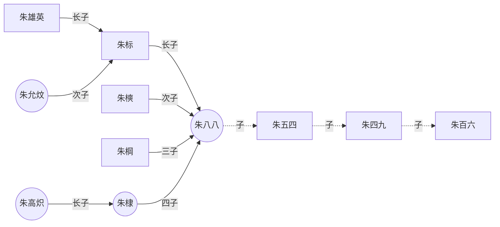

+++
title = '我的第一篇博客'
date = '2025-07-04T20:13:45+08:00'
draft = false
tags = ['Hugo', '博客']
categories = ['技术']
+++

# 欢迎来到我的博客

这是我用Hugo创建的第一篇博客文章。Hugo是一个非常强大且高效的静态网站生成器。

## 为什么选择Hugo？

1. **速度快** - Hugo是目前最快的静态网站生成器之一
2. **易于使用** - 简单的配置和清晰的文档
3. **主题丰富** - 有大量美观的主题可供选择
4. **强大的内容管理** - 支持文章分类、标签等功能

## 代码示例

```go
package main

import "fmt"

func main() {
    fmt.Println("Hello, Hugo!")
}
```

## 接下来的计划

- 分享更多技术文章
- 优化网站设计
- 添加更多功能

希望大家喜欢我的博客！


