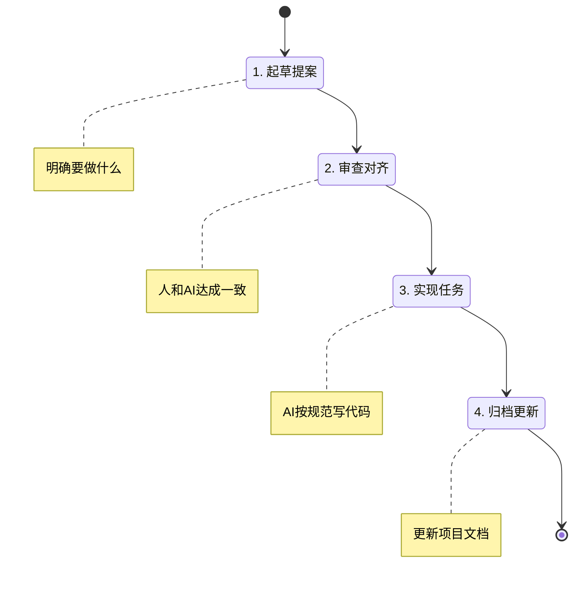

+++
date = '2025-10-30T15:03:08+08:00'
draft = false
title = 'Spec Coding 调研'
tags = ["AI"]
+++
## 什么是spec coding

Spec coding 是一种通过 AI 生成代码和方案的开发方式，它通过先定义"做什么"，再决定"怎么做"的方式，帮助开发者聚焦在业务逻辑和架构设计上，而将重复性的编码工作交给 AI 完成。

## 对比 vibe coding

### 不同

1. 从研发周期上看，拆解为不同的阶段或者角色，每个阶段都有对应的输入和输出要求
2. 每个角色阶段之间没有状态，不进行上下文持久化和传递
3. 每个阶段都有对应的规范文档，并按照特定的名称持久化在特定的工程目录中
4. 每个阶段记录过程，人工都可以被动或主动进行澄清
5. 文档不是静态的，需要动态变化，不断对齐现实，保持和现实的一致性

### 优点

1. 通过文档建立持久化的知识库，每个独立任务保持无状态，避免上下文混乱和信息丢失。
2. 文档代表事实真相，与代码保持一致性。文档不是静态的，而是动态变化，不断对齐现实，确保文档和实际代码的同步。
3. 开发者可以专注于"做什么"（业务逻辑和架构设计），而将重复性的编码工作交给 AI 完成，提高开发效率。
4. 通过明确的规范定义，AI 能够准确理解开发意图，生成高质量、可预测的代码，大大减少开发时间和沟通成本。
5. 从研发周期上拆解为不同的阶段或角色（constitution → specify → plan → tasks → implement），每个阶段都有对应的输入和输出要求，流程清晰可控。
6. 每个阶段都记录过程，人工可以被动或主动进行澄清和调整，保持对开发过程的控制。

总结：让 AI 辅助开发变得更加**可控**、**可靠**和**高效**，彻底解决了 AI 编程助手"不可控"的痛点。

## spec-kit

<https://github.com/github/spec-kit>

### spec-kit 介绍

spec-kit 是由 GitHub 开发的规范驱动开发（Spec-Driven Development, SDD）工具，旨在帮助开发团队专注于产品场景而非重复编码，从而构建高质量的软件。它通过先定义"做什么"，再决定"怎么做"的方式，让 AI 更好地理解和执行开发任务。

### spec-kit 工作流程

spec-kit 的开发流程分为五个主要阶段：

#### 1. constitution

这是整个开发流程的基础阶段，需要明确项目的核心价值观和开发准则。constitution 文件定义了项目的"宪法"，包括：

- **核心原则**：项目的基本理念和价值观，如代码质量标准、安全要求、性能目标等
- **技术约束**：技术栈选择、架构风格、编码规范等技术层面的限制
- **团队协作规则**：代码审查流程、文档要求、沟通方式等
- **质量标准**：测试覆盖率要求、性能指标、可维护性标准等

constitution 会被存储在 `.specify/memory/constitution.md` 文件中，作为后续所有开发决策的参考依据。AI 在生成代码和方案时会严格遵循这些原则，确保输出的一致性和可预测性。

#### 2. specify

**创建项目规范** 在这个阶段，需要详细描述项目的具体需求和功能特性。specify 阶段的核心是创建一个清晰、完整的规范文档（spec.md），它应该包含：

- **功能描述**：详细说明要实现的功能是什么，解决什么问题
- **用户场景**：描述用户如何使用这个功能，包括典型的使用流程
- **业务规则**：明确业务逻辑和约束条件
- **输入输出**：定义系统的输入数据和期望的输出结果
- **边界条件**：说明异常情况和边界情况的处理方式
- **非功能需求**：性能要求、安全要求、可用性要求等

```txt

└── .specify
    ├── memory
    │  └── constitution.md
    ├── scripts
    │  ├── check-prerequisites.sh
    │  ├── common.sh
    │  ├── create-new-feature.sh
    │  ├── setup-plan.sh
    │  └── update-claude-md.sh
    ├── specs
    │  └── 001-create-taskify
    │      └── spec.md
    └── templates
        ├── plan-template.md
        ├── spec-template.md
        └── tasks-template.md
```

#### 3. clarify - 可选

**澄清未明确的部分** 这是一个可选但非常重要的阶段，用于识别和解决规范中的模糊点和不确定性。在 specify 阶段完成后，AI 或团队成员可能会发现一些需要进一步明确的问题，通过这个阶段，可以大大减少后续开发中的返工和误解，确保所有参与者对需求有统一的理解。

#### 4. plan

**制定技术实施方案** 在明确了"做什么"之后，plan 阶段开始回答"怎么做"的问题。这个阶段将高层次的需求转化为具体的技术实施方案，包括：

- **架构设计**：定义系统的整体架构，包括前端、后端、数据库等各层的设计
- **技术选型**：选择合适的技术栈、框架和工具库
- **数据模型设计**：设计数据库表结构、实体关系、数据流等（data-model.md）
- **API 契约定义**：定义 API 接口规范，包括端点、请求/响应格式、错误码等（contracts/api-spec.json）
- **通信协议**：如果涉及实时通信，定义 WebSocket、SignalR 等协议规范（contracts/signalr-spec.md）
- **技术调研**：记录技术方案的调研过程和决策依据（research.md）
- **快速启动指南**：提供项目的快速开始文档（quickstart.md）

完成这个阶段后，会生成详细的 `plan.md` 文件和相关的技术文档，同时更新 `CLAUDE.md` 文件，为 AI 提供完整的项目上下文。

**输出文件**：

- `plan.md`：详细的技术实施计划
- `data-model.md`：数据模型设计文档
- `contracts/`：API 和通信协议规范
- `research.md`：技术调研文档
- `CLAUDE.md`：AI 助手的项目上下文文件

```txt
.
├── CLAUDE.md
├── memory
│  └── constitution.md
├── scripts
│  ├── check-prerequisites.sh
│  ├── common.sh
│  ├── create-new-feature.sh
│  ├── setup-plan.sh
│  └── update-claude-md.sh
├── specs
│  └── 001-create-taskify
│      ├── contracts
│      │  ├── api-spec.json
│      │  └── signalr-spec.md
│      ├── data-model.md
│      ├── plan.md
│      ├── quickstart.md
│      ├── research.md
│      └── spec.md
└── templates
    ├── CLAUDE-template.md
    ├── plan-template.md
    ├── spec-template.md
    └── tasks-template.md
```

#### 5. tasks

**任务分解** tasks 阶段将宏观的技术方案分解为可执行的具体任务。这是连接规划和实施的关键环节

#### 6. analyze - 可选

**一致性分析** analyze 阶段是质量保证的重要环节，用于在实施前验证整个规范体系的完整性和一致性。这个可选阶段可以帮助提前发现潜在问题，通过这个阶段，可以在投入大量开发资源之前发现和解决问题，避免后期的重大返工。

#### 7. implement

**任务实施** implement 是整个流程的执行阶段，按照前面定义的规范、计划和任务列表进行实际的代码开发。这个阶段的特点是：

- **任务驱动开发**：严格按照 tasks 阶段分解的任务列表逐项执行
- **规范遵循**：开发过程中始终参考 spec.md、plan.md 和 constitution.md，确保实现符合预期
- **增量交付**：每完成一个任务就进行测试和验证，采用小步快跑的方式
- **AI 辅助编码**：利用 AI 助手根据规范自动生成代码，提高开发效率
- **持续验证**：在实施过程中不断验证代码是否满足验收标准

**实施流程**：

1. **选择任务**：从任务列表中选择下一个要执行的任务（考虑依赖关系和优先级）
2. **理解需求**：仔细阅读任务描述、相关规范和技术方案
3. **编写代码**：根据规范实现功能，AI 可以根据上下文自动生成大部分代码
4. **编写测试**：为新功能编写单元测试和集成测试
5. **代码审查**：检查代码是否符合 constitution 中的质量标准
6. **验收确认**：验证任务是否满足验收标准，标记任务完成状态

**AI 的角色**：

- 根据规范自动生成样板代码
- 提供技术实现建议
- 自动补全和重构代码
- 生成测试用例
- 识别潜在的 bug 和代码异味

**关键优势**：
由于前期已经做了充分的规范定义和计划，AI 能够准确理解开发意图，生成高质量、可预测的代码，大大减少了开发时间和沟通成本。开发者可以专注于业务逻辑和架构设计，而将重复性的编码工作交给 AI 完成。

## OpenSpec

<https://github.com/Fission-AI/OpenSpec>

### OpenSpec 介绍

OpenSpec 是一个轻量级的规范驱动开发框架，旨在协调开发者与各类 AI 编码助手的协作。它通过结构化的需求文档和场景驱动的设计，让 AI 生成的代码具有可预测性、高质量和零猜测的特点。

OpenSpec 特别适合在已有项目基础上进行迭代开发，能够彻底解决 AI 编程助手"不可控"的痛点，让 AI 辅助开发变得更加可靠和高效。

### 工作流程



当走完第一个阶段「起草提案」之后，会生成成 proposal.md、design.md、 tasks.md、spec 目录（规范）

## 总结

spec-kit 和 OpenSpec 都采用规范驱动开发方法，但各有侧重：

- **spec-kit** 更适合从零开始的新项目开发，强调意图驱动和 AI 增强的规范创建，由 GitHub 官方维护
- **OpenSpec** 更适合现有项目的迭代开发和变更管理，提供轻量级框架和完整的变更管理流程，完全开源

两者都能显著提升 AI 辅助开发的效率和代码质量，让开发者能够更好地控制 AI 的输出，实现可预测、高质量的软件开发。

## 参考

<https://www.aivi.fyi/llms/introduce-OpenSpec>
