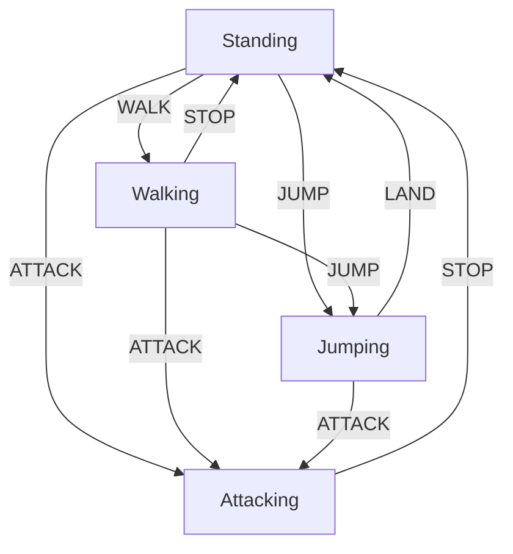
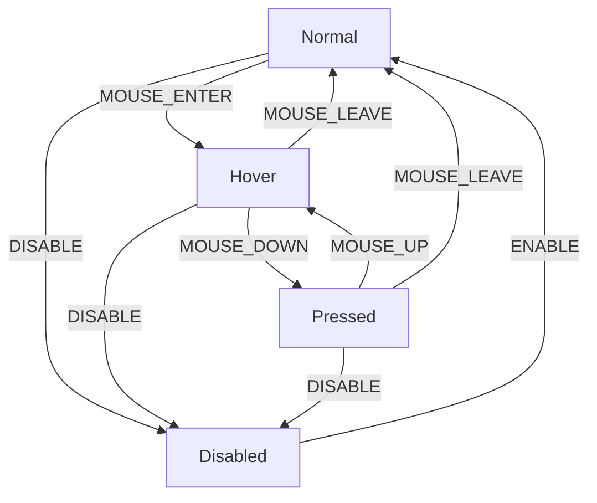
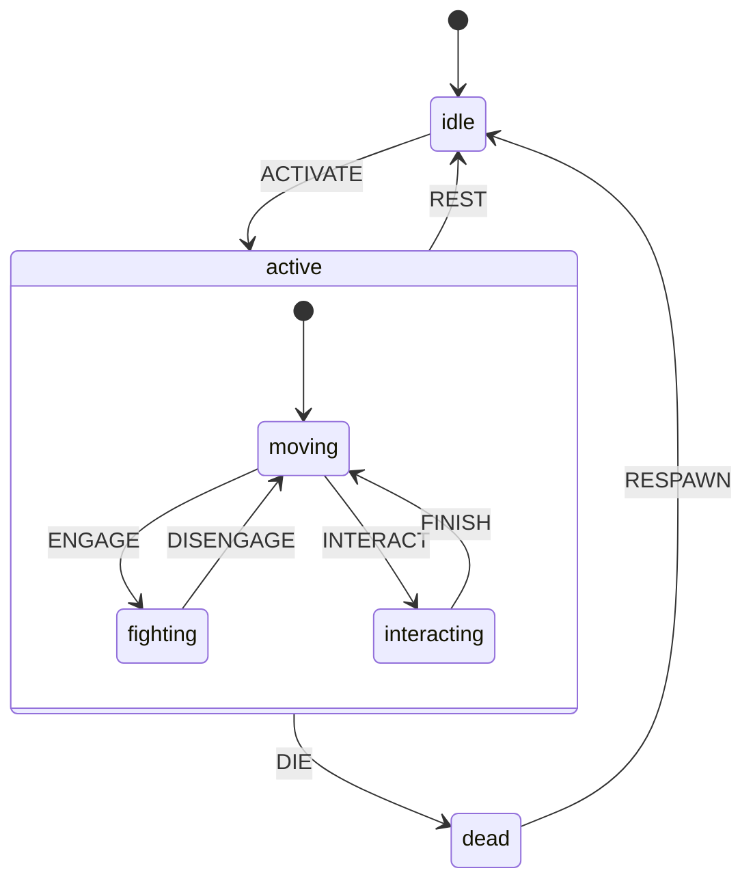

+++
date = '2025-07-08T14:03:56+08:00'
draft = true
title = 'StateMachine'
tags = ['3D', '设计模式']
+++

## 状态机概述

状态机是一种计算模型，用于描述系统在不同状态之间的转换逻辑。它由状态（States）、事件（Events）和转换（Transitions）组成。状态机在任一时刻只能处于一个特定状态，通过触发事件使其从一个状态转换到另一个状态。

## 核心概念

- **状态（State）**：系统可能处于的一种情况或模式。
- **事件（Event）**：触发状态转换的信号或动作。
- **转换（Transition）**：定义从一个状态到另一个状态的规则。
- **回调（Callback）**：状态转换时执行的逻辑。

## 应用场景

状态机在以下场景中特别有用：

- 游戏开发：管理游戏角色的不同状态（站立、行走、攻击、受伤等）。
- UI 交互：控制界面元素在不同状态下的行为（正常、悬停、激活、禁用）。
- 工作流管理：追踪业务流程的不同阶段（创建、审核、发布）。
- 协议实现：网络协议的状态管理（连接中、已连接、断开连接）。
- 动画控制：管理动画序列和转换。

## 基本用法

```typescript
// 定义状态和事件类型
type State = 'idle' | 'running' | 'paused' | 'stopped';
type Event = 'START' | 'PAUSE' | 'RESUME' | 'STOP';

// 创建状态机实例
const sm = new StateMachine<State, Event>('idle', [
  t('idle', 'START', 'running'),
  t('running', 'PAUSE', 'paused'),
  t('paused', 'RESUME', 'running'),
  t('running', 'STOP', 'stopped'),
]);

// 触发状态转换
await sm.dispatch('START');  // idle -> running
console.log(sm.getState());  // 'running'
```

## 高级特性

### 全局事件（ANY_STATE）

使用 `ANY_STATE` 符号定义可从任意状态触发的转换：

```typescript
// RESET 事件可从任何状态回到 idle 状态
sm.addTransitions([
  t(ANY_STATE, 'RESET', 'idle', resetCallback)
]);
```

### 状态查询和预测

```typescript
// 检查当前状态是否可以接收特定事件
if (sm.can('PAUSE')) {
  // 可以执行暂停操作
}

// 获取事件触发后的下一个状态
const nextState = sm.getNextState('STOP');  // 'stopped'

// 检查当前是否为终止状态（没有可用的出站转换）
if (sm.isFinal()) {
  // 到达终止状态
}
```

### 子状态机

子状态机是一种嵌套状态机机制，允许在一个主状态内部有自己的状态转换逻辑。这对于构建复杂的分层状态行为非常有用

```typescript
// 创建子状态机
const subMachine = new StateMachine<SubState, SubEvent>('subIdle', [
  t('subIdle', 'SUB_START', 'subRunning'),
  t('subRunning', 'SUB_STOP', 'subStopped')
]);

// 创建主状态机
const mainMachine = new StateMachine<MainState, MainEvent>('idle', [
  t('idle', 'START', 'running'),
  t('running', 'STOP', 'stopped')
]);

// 将子状态机附加到主状态机的特定状态
mainMachine.addSubStateMachine('running', subMachine);
```

## 核心设计问题

### 状态切换回掉的处理

- 每次派发事件，状态机会立即进行响应，更新新的状态
- 针对事件切换回调函数执行，不会卡住状态机的状态
- 极端情况下，存在多个状态回调函数同时在执行的情况

### 子状态机的生命周期

- 当主状态机进入子状态时，子状态机被激活
- 子状态机可以处理自己的事件和状态转换。
- 当主状态机离开子状态时，子状态机被自动重置（reset）
- 子状态机只有在父状态机处于激活状态时才能接收事件

## 实际应用示例

### 游戏角色控制



```typescript
type CharacterState = 'standing' | 'walking' | 'jumping' | 'attacking';
type CharacterEvent = 'WALK' | 'JUMP' | 'ATTACK' | 'STOP' | 'LAND';

// 创建角色状态机
const character = new StateMachine<CharacterState, CharacterEvent>('standing', [
  t('standing', 'WALK', 'walking', startWalkAnimation),
  t('walking', 'STOP', 'standing', stopWalkAnimation),
  t('standing', 'JUMP', 'jumping', startJumpAnimation),
  t('walking', 'JUMP', 'jumping', startJumpAnimation),
  t('jumping', 'LAND', 'standing', landAnimation),
  t(ANY_STATE, 'ATTACK', 'attacking', attackAnimation),
  t('attacking', 'STOP', 'standing', stopAttackAnimation),
]);
```

### UI 组件状态管理



```typescript
type ButtonState = 'normal' | 'hover' | 'pressed' | 'disabled';
type ButtonEvent = 'MOUSE_ENTER' | 'MOUSE_LEAVE' | 'MOUSE_DOWN' | 'MOUSE_UP' | 'DISABLE' | 'ENABLE';

// 创建按钮状态机
const button = new StateMachine<ButtonState, ButtonEvent>('normal', [
  t('normal', 'MOUSE_ENTER', 'hover', showHoverEffect),
  t('hover', 'MOUSE_LEAVE', 'normal', removeHoverEffect),
  t('hover', 'MOUSE_DOWN', 'pressed', showPressedEffect),
  t('pressed', 'MOUSE_UP', 'hover', removePressedEffect),
  t('pressed', 'MOUSE_LEAVE', 'normal', removeAllEffects),
  t(ANY_STATE, 'DISABLE', 'disabled', disableButton),
  t('disabled', 'ENABLE', 'normal', enableButton),
]);
```

### 游戏角色管理系统

这个例子展示了如何使用嵌套状态机来管理游戏角色的复杂状态。主状态机处理角色的生命周期（闲置、活动、死亡），而子状态机则专注于角色在"活动"状态下可以执行的各种行为



```ts
// 主状态机状态和事件
type MainState = 'idle' | 'active' | 'dead';
type MainEvent = 'ACTIVATE' | 'REST' | 'DIE' | 'RESPAWN';

// 子状态机状态和事件
type ActiveState = 'moving' | 'fighting' | 'interacting';
type ActiveEvent = 'ENGAGE' | 'DISENGAGE' | 'INTERACT' | 'FINISH';

// 创建子状态机（角色活动状态）
const activeStateMachine = new StateMachine<ActiveState, ActiveEvent>('moving', [
  t('moving', 'ENGAGE', 'fighting', startCombatSystem),
  t('fighting', 'DISENGAGE', 'moving', endCombatSystem),
  t('moving', 'INTERACT', 'interacting', startInteraction),
  t('interacting', 'FINISH', 'moving', endInteraction)
]);

// 创建主状态机（角色生命周期）
const characterManager = new StateMachine<MainState, MainEvent>('idle', [
  t('idle', 'ACTIVATE', 'active', activateCharacter),
  t('active', 'REST', 'idle', deactivateCharacter),
  t('active', 'DIE', 'dead', handleDeath),
  t('dead', 'RESPAWN', 'idle', handleRespawn)
]);

// 将活动状态子状态机附加到主状态机的"active"状态
characterManager.addSubStateMachine('active', activeStateMachine);

// 使用示例
await characterManager.dispatch('ACTIVATE');  // 进入active状态，子状态机激活
await activeStateMachine.dispatch('ENGAGE');  // 切换到战斗状态
await activeStateMachine.dispatch('DISENGAGE');  // 返回移动状态
await characterManager.dispatch('REST');  // 回到idle状态，子状态机重置
```

## 结合

### 和UI结合

   

### 和AI结合

   

## 总结

状态机提供了一种清晰、直观的方式来管理复杂系统的状态转换逻辑。通过明确定义状态、事件和转换规则，可以有效避免状态管理中的混乱和错误。子状态机机制进一步增强了状态机的能力，使其能够处理更复杂的分层状态结构。无论是游戏开发、UI交互还是业务流程管理，状态机都是一种强大而灵活的解决方案。
