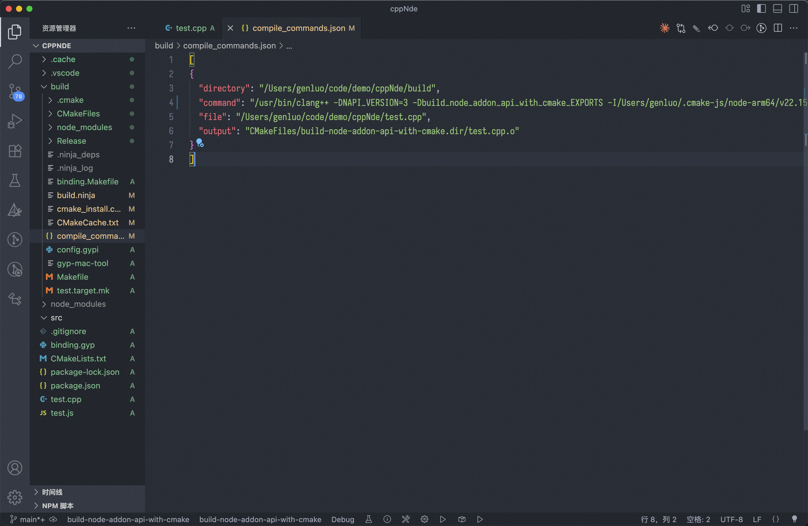
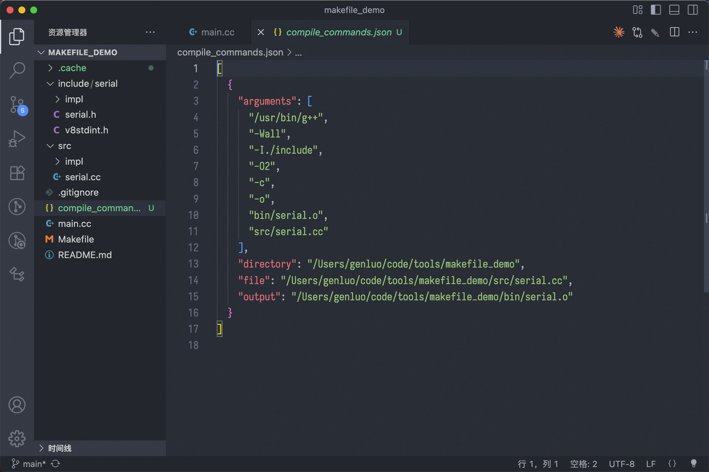
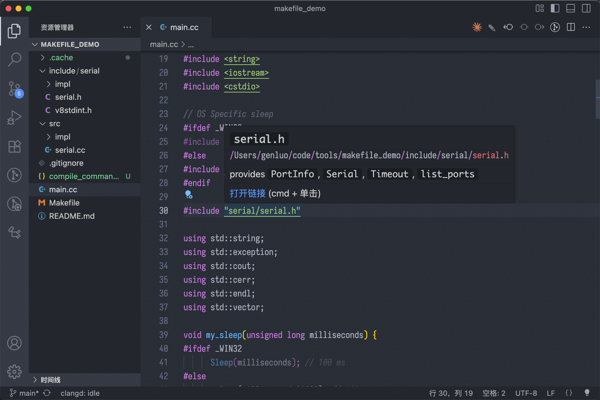

+++
date = '2025-08-08T17:41:50+08:00'
draft = false
title = 'Vscode+clangd'
tag = ['vscode']
+++
## 基本配置

一般来说，`vscode` 中开发 `c++` 项目使用的都是微软提供的插件，但是这个插件不是很好用，推荐使用 `clangd` ，相比于微软的插件来说，错误的提示更好点，同时速度要快很多

### 基础配置

如果使用 `cmake` 进行开发，可以添加编译参数 `-DCMAKE_EXPORT_COMPILE_COMMANDS=ON` 来生成 `clangd` 需要的 `compile_commands.json` 来索引整个项目的源文件

通过 `cmake` 进行配置生成，包含


### [bear](https://github.com/rizsotto/Bear) 工具介绍

> generates a compilation database for clang tooling.

如果使用的是其他的构建系统，没有使用 `cmake` 可以使用这个工具，生成对应的 `compile_commands.json`

```shell
bear -- make
```



重启服务之后，可以正常进行跳转


